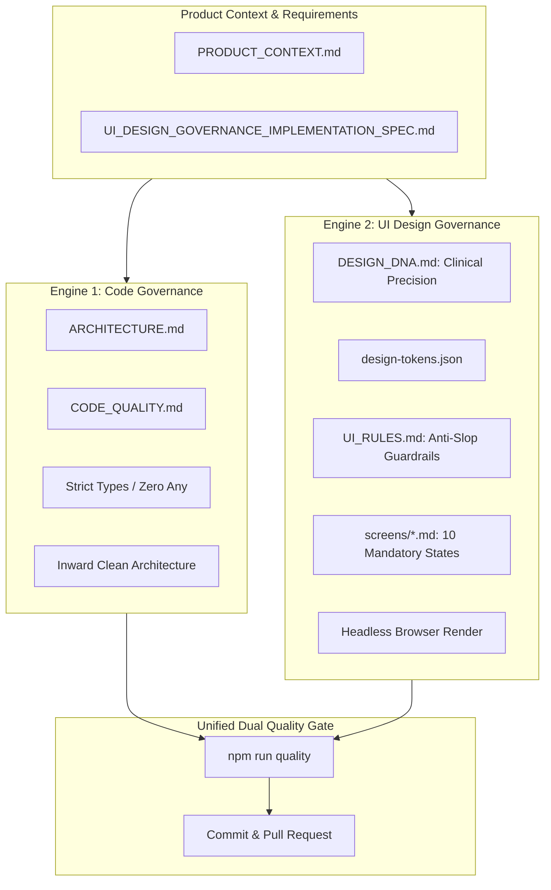

# Universal Vibe Coding Agent Constitution: Code & UI Design Governance

> **Core Philosophy:** *AI coding agents are free to generate functionality rapidly, but are strictly prohibited from degrading project architecture, safety, code quality, or user interface elegance.*

This document serves as the **Single Source of Truth (SSOT)** and **Development Constitution** for all AI Coding Agents (including OpenAI Codex, Claude Code, Cursor, GitHub Copilot, Gemini, and Windsurf) operating within this repository.

---

## 1. Dual-Engine Governance Architecture



---

## 2. Architectural Boundaries & Dependency Rules (Code Governance)

1. **Inward Dependency Rule**: Source code dependencies must point inwards only.
   - **Domain Layer**: Zero dependencies on outer layers or external libraries. Pure business logic and domain entities only.
   - **Application Layer**: Depends only on Domain. Inverts infrastructure dependencies via port interfaces.
   - **Infrastructure Layer**: Implements Application port interfaces. Must not depend on Presentation.
   - **Presentation Layer**: Consumes Application use-cases. Must not bypass Application to access Infrastructure directly.
2. **Circular Dependencies**: **Strictly forbidden.** Any cyclic import graph fails the Quality Gate immediately.
3. **Module Boundaries**: Depend strictly on exported public interfaces; do not reach into internal private files of other modules.

---

## 3. Code Quality & Local Reasoning Standards

1. **Function Length & Complexity**: Target < 30 lines; hard ceiling of **50 lines**. Cyclomatic complexity ceiling of **12**.
2. **Control Flow**: Flatten logic using guard clauses and early returns. Never nest `if` statements exceeding 2 levels.
3. **Semantic Naming**: Use intent-revealing business names (`pendingEvaluations`, `evaluateQualityGate()`). Booleans must read like true/false questions (`isCompliant`, `hasViolations`).
4. **Strong Typing**: Use Enums, Union Types, or frozen value objects. **Never use `any`**, unchecked casts, or suppression directives.
5. **Strict Error Handling**: Zero empty catch blocks. Catch blocks must log contextual metadata, wrap in a domain exception, or rethrow.

---

## 4. UI Design Governance & Anti-Slop Mandates

AI agents must strictly eliminate generic "AI Slop" aesthetics and build professional, production-grade interfaces adhering to:

### 4.1 Negative Constraints (Strictly Banned Patterns)
- ❌ **No Purple/Blue Gradient Clichés**: Never apply `linear-gradient` hero fills or marketing gradients.
- ❌ **No Gradient Text**: Never render headings with gradient fills (`-webkit-text-fill-color: transparent`).
- ❌ **No Glowing Neon Shadows**: Never apply glowing colored box-shadows. Use crisp 1px borders for delineation.
- ❌ **No "Card Soup"**: Do not wrap every arbitrary element in a rounded card. Never nest cards deeper than 1 level.
- ❌ **No Pill Buttons Everywhere**: Standard actions must use calibrated `radius-md` (6px) controls, never full-pill `rounded-full`.
- ❌ **No Marketing Hero in Tools**: Productivity and operational consoles must prioritize immediate data density and workflows over 80px marketing banners.
- ❌ **No Fake Vanity KPIs**: Do not invent arbitrary metric tiles with meaningless sparklines unless tied to real domain data.
- ❌ **No Excessive Whitespace**: Never inject arbitrary 64px+ spacing in dense professional workbench software.

### 4.2 Positive Design Imperatives
- ✅ **Spec-First Engineering**: Read or create `design/screens/<screen>.md` before writing UI code.
- ✅ **Design Tokens Compliance**: All colors, radiuses, paddings, and font sizes must reference `design/design-tokens.json` (zero hardcoded arbitrary pixel values).
- ✅ **Clinical Precision Archetype**: Follow the structural, high-density, monochrome foundation specified in `DESIGN_DNA.md`.
- ✅ **10-State Screen Completeness**: Every screen and interactive workflow must specify and account for the 10 states:
  1. Default, 2. Loading, 3. Empty, 4. Error, 5. Success, 6. Disabled, 7. Unauthorized, 8. Offline, 9. Overflow, 10. Large Dataset.
- ✅ **Evidence-Based Browser Verification**: Never trust code alone. Run `npm run ui:screenshot` to capture and inspect real multi-viewport renderings (Desktop 1440x900, Tablet 768x1024, Mobile 375x812).

---

## 5. AI Agent Autonomous Execution Workflow

Every coding and UI task assigned to an AI Agent must strictly follow this lifecycle:

1. **Ingest Rules & Context**: Read `AGENTS.md`, `ARCHITECTURE.md`, `PRODUCT_CONTEXT.md`, and `DESIGN_DNA.md`.
2. **Search Before Creating**: Search existing abstractions, utilities, and components before writing new code.
3. **Spec-First Design**: For any UI addition, ensure `design/screens/<name>.md` exists with complete 10-state specifications.
4. **Minimal Atomic Implementation**: Make small, cohesive modifications strictly referencing `design-tokens.json`.
5. **Headless Browser Execution**: Render the UI and capture screenshot evidence across viewports (`npm run ui:screenshot`).
6. **Execute Unified Quality Gate**:
   ```bash
   npm run quality
   ```
7. **Autonomous Repair Loop**: If any code lint, typecheck, architecture check, UI anti-slop linter, or test fails, diagnose root cause, repair structurally, and re-run. Never bypass or disable checks.
8. **Commit & PR**: Once 100% green, commit using Conventional Commits.

---

## 6. Definition of Done (DoD) Checklist

A task is **only complete** when all of the following conditions are verified:

- [ ] **Format Check**: Code adheres to Biome formatting (`npm run format:check`).
- [ ] **Linter**: Zero lint errors and zero warnings (`npm run lint`).
- [ ] **Type Check**: Zero compiler type errors under strict mode (`npm run typecheck`).
- [ ] **Architecture Check**: Zero illegal layer access and zero circular imports (`npm run arch:check`).
- [ ] **Security Scan**: Zero hardcoded secrets, zero empty catches, zero `any` bypasses (`npm run security:check`).
- [ ] **Design Tokens Conformance**: 100% compliant with `design-tokens.json` (`npm run ui:tokens`).
- [ ] **UI Anti-Slop Linter**: Zero gradient/glow/pill slop violations and 10-state completeness (`npm run ui:lint`).
- [ ] **Screenshot Evidence**: Verified captures saved in `screenshots/desktop/`, `tablet/`, `mobile/` (`npm run ui:screenshot`).
- [ ] **Test Suite**: 100% test pass rate with regression coverage (`npm run test`).
- [ ] **Clean Git Status**: All artifacts, tests, specs, and tokens committed cleanly.
