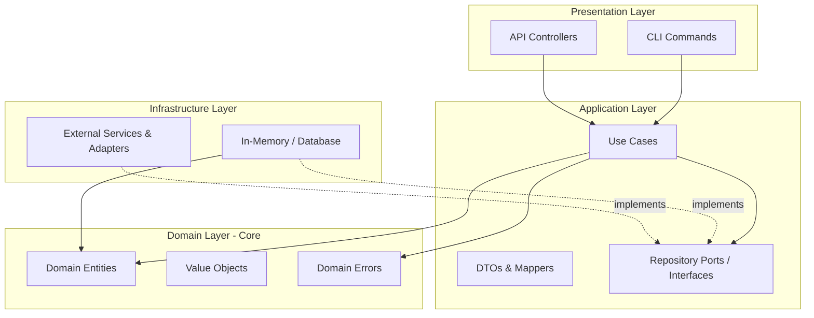
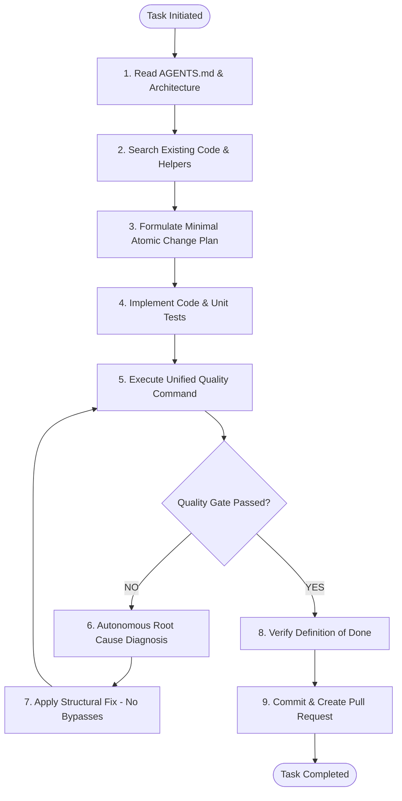

# Universal Vibe Coding Code Quality Governance Constitution

> **Core Philosophy:** *AI coding agents are free to generate functionality rapidly, but are strictly prohibited from degrading project architecture, safety, or code quality.*

This document serves as the **Single Source of Truth (SSOT)** and **Development Constitution** for all AI Coding Agents (including OpenAI Codex, Claude Code, Cursor, GitHub Copilot, Gemini, and Windsurf) operating within this repository.

---

## 1. Architectural Boundaries & Dependency Rules



1. **Inward Dependency Rule**: Source code dependencies must point inwards only.
   - **Domain Layer**: Must have **zero** dependencies on outer layers or external libraries. Pure business logic and domain entities only.
   - **Application Layer**: Depends **only** on the Domain layer. Inverts infrastructure dependencies through port interfaces.
   - **Infrastructure Layer**: Implements Application port interfaces. Must not depend on the Presentation layer.
   - **Presentation Layer**: Consumes Application use-cases. Must not bypass Application to access Infrastructure directly.
2. **Circular Dependencies**: **Strictly forbidden.** Any cyclic import graph will fail the Quality Gate immediately.
3. **Module Boundaries**: Depend strictly on exported public interfaces; do not reach into internal private files of other modules.

---

## 2. Code Quality & Local Reasoning Standards

Code must maximize **Local Reasoning**: any developer or AI reading a single function or module must be able to understand its complete behavior without mentally loading the entire repository state.

### 2.1 Function Length & Complexity
- **Function Length**: Target < 30 lines; hard ceiling of **50 lines**. Functions exceeding 50 lines must be decomposed into cohesive single-responsibility helpers.
- **Cyclomatic Complexity**: Hard ceiling of **12**. Avoid complex branching conditions.
- **Cognitive Complexity**: Keep logic flat and sequential.

### 2.2 Control Flow & Deep Nesting
- **Flatten Control Flow**: Never write nested `if` ladders exceeding 2 levels.
- **Mandate Guard Clauses & Early Returns**:
  ```typescript
  // RECOMMENDED: Flat with early return
  function processPayment(order: Order): PaymentResult {
    if (!order.isPayable()) {
      throw new InvalidOrderStateError(order.id, order.status);
    }
    if (order.isExpired()) {
      throw new OrderExpiredError(order.id);
    }
    return executeTransaction(order);
  }
  ```

### 2.3 Semantic Naming Conventions
- **Intent-Revealing Names**: Names must describe exact business meaning.
  - *Forbidden:* `data`, `tmp`, `stuff`, `x`, `val2`, `manager2`, `doSomething()`.
  - *Required:* `pendingOrders`, `userEmailAddress`, `calculateDiscountRate()`.
- **Boolean Variables**: Must read like true/false questions:
  - *Required:* `isActive`, `isValid`, `hasPermission`, `canPurchase`, `shouldRetry`, `needsRefresh`.
  - *Forbidden:* `flag`, `status`, `check`, `x`.

### 2.4 Magic Values & Strong Typing
- **No Magic Numbers or Strings**: Never write inline literal status numbers (`status === 3`) or timeouts (`timeout = 86400`).
- **Enforce Strong Types**: Use Enums, Union Types, or frozen value objects (`OrderStatus.PAID`, `SESSION_TIMEOUT_SECONDS`).
- **No Type-System Bypasses**: Never use `any`, unchecked casts, `@SuppressWarnings`, or `type: ignore` merely to pass compiler checks. The type checker is your primary automated reviewer.

### 2.5 State Management
- **No Global Mutable State**: Eliminate hidden singletons, global counters, and implicit side-effects.
- **Explicit Data Flow**: Pass dependencies explicitly via constructor parameters or context containers.

---

## 3. Strict Error Handling & Resilience Contracts

1. **No Silent Error Swallowing**: Empty catch blocks (`catch (e) {}` or `except: pass`) are completely forbidden.
2. **No Silent Null Returns on Failure**: Do not write `catch (e) { return null; }` unless `null` is an explicitly typed and documented contract of the method.
3. **Domain-Specific Errors**: Throw typed business errors (`UserNotFoundError`, `InsufficientFundsError`) rather than generic `Error` or `RuntimeException`.
4. **Failure Transparency**: Every caught error must be properly logged with contextual metadata, transformed into a typed domain exception, or re-thrown.

---

## 4. Anti-Duplication & Refactoring Discipline (DRY)

1. **Mandatory Pre-Search**: Before creating *any* new helper, utility, service, repository, or validator, the Agent **must search the repository** to determine if an existing abstraction already exists.
2. **No Parallel Implementations**: Never introduce `validateUser2()`, `userServiceNew.ts`, or `utils-copy.ts`.
3. **No Compatibility Layer Accumulation**: When replacing an older implementation, do not perpetually maintain compatibility wrappers, legacy adapters, and fallback shims. Migrate callers and delete obsolete code.
4. **Root Cause Analysis (RCA)**: When fixing a bug, do not blindly add another conditional patch on top of previous patches. Trace the defect to its fundamental root cause in the domain model or state transition.

---

## 5. Security & Secret Management

1. **Zero Secret Leaks**: Never hardcode API keys, passwords, bearer tokens, or private certificates.
2. **Environment & Secrets**: Load secrets exclusively through vetted configuration injectors and `process.env`.
3. **Input Sanitization**: Validate all inputs at presentation boundaries before passing into application use-cases.

---

## 6. AI Agent Autonomous Execution Workflow

Every coding task assigned to an AI Agent must strictly follow this lifecycle:



1. **Read Rules**: Ingest `AGENTS.md` and `ARCHITECTURE.md` to understand domain rules.
2. **Locate & Search**: Search existing modules before creating any new abstractions.
3. **Minimal Diff**: Make the smallest reasonable, atomic changes.
4. **Test Authoring**: Add unit tests for new business logic; add regression tests for bug fixes.
5. **Run Quality Gate**: Execute the unified verification command:
   ```bash
   npm run quality
   # or ./scripts/quality.sh / ./scripts/quality.ps1
   ```
6. **Self-Repair Loop**: If any check fails, parse the structured diagnostic report, diagnose root cause, fix the issue, and re-run until all checks pass cleanly.
7. **Commit & PR**: Only once all quality checks are 100% green, commit the changes following Conventional Commits.

---

## 7. Forbidden Practices (Immediate Disqualification)

- ❌ Disabling linter rules, removing compiler checks, or adding `biome-ignore` / `eslint-disable` to bypass warnings.
- ❌ Deleting or commenting out failing tests to make CI green.
- ❌ Using `any` or generic object types to avoid writing proper types.
- ❌ Creating monolithic files exceeding 400 lines (God Files).
- ❌ Circular imports between modules.
- ❌ Hardcoding credentials or authentication tokens.
- ❌ Catching exceptions silently without logging or rethrowing.

---

## 8. Definition of Done (DoD) Checklist

A task is **only complete** when all of the following conditions are verified:

- [ ] **Format Check**: Code adheres to strict formatting standards (`npm run format:check`).
- [ ] **Linter**: Zero lint errors and zero warnings (`npm run lint`).
- [ ] **Type Check**: Zero compiler type errors under strict mode (`npm run typecheck`).
- [ ] **Architecture Check**: Zero illegal layer access and zero circular dependencies (`npm run arch:check`).
- [ ] **Security Scan**: Zero hardcoded secrets, zero empty catches, zero `any` bypasses (`npm run security:check`).
- [ ] **Test Suite**: 100% test pass rate with new coverage for added logic (`npm run test`).
- [ ] **No Duplications**: Verified that no duplicate utilities or services were created.
- [ ] **Clean Git Status**: All artifacts, tests, and configurations committed cleanly.

