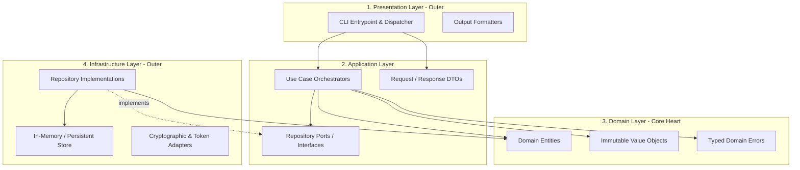
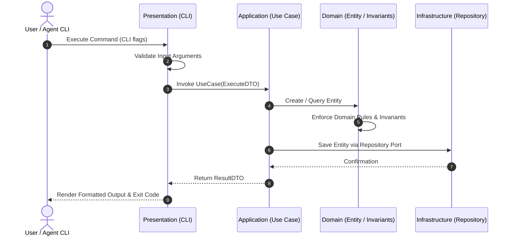

# System Architecture & Boundary Specification

This document details the architectural design, module boundaries, layer dependency rules, and data flows governing this system.

---

## 1. Architectural Style: Clean Layered Architecture

The repository enforces a strict **Clean Architecture (Ports and Adapters)** model. Code is organized into four concentric layers where the inner business domain remains completely independent of frameworks, databases, and user interfaces.

---

## 2. Layer Specifications & Responsibilities

### 2.1 Domain Layer (`src/domain/`)
- **Responsibility:** Contains the pure enterprise business logic, invariants, and domain rules.
- **Components:**
  - `entities/`: Rich domain models with state and business behavior.
  - `value-objects/`: Immutable objects defined by their attributes rather than identity (e.g. `EmailAddress`, `Money`).
  - `errors/`: Semantic business exceptions (`UserNotFoundError`, `DuplicateResourceError`).
  - `repositories/`: Port interfaces defining data access contracts needed by the domain/use-cases.
- **Rules:**
  - **Zero external dependencies.**
  - **Zero framework imports.**
  - Must never import from Application, Infrastructure, or Presentation.

### 2.2 Application Layer (`src/application/`)
- **Responsibility:** Coordinates use cases, encapsulates application workflows, maps data between domain and external contracts.
- **Components:**
  - `use-cases/`: Single-purpose application workflows (e.g. `CreateUserUseCase`, `VerifyQualityGateUseCase`).
  - `dto/`: Plain data transfer objects decoupled from internal domain entities.
  - `services/`: Domain orchestration helpers.
- **Rules:**
  - Depends only on `src/domain/`.
  - Must never directly import concrete implementations from `src/infrastructure/`. Dependencies are inverted through repository ports.

### 2.3 Infrastructure Layer (`src/infrastructure/`)
- **Responsibility:** Implements technical details, data persistence, network communication, and hardware adapters.
- **Components:**
  - `persistence/`: Concrete repository implementations (e.g. `InMemoryUserRepository`, database clients).
  - `security/`: Hashing, encryption, and environment token loaders.
- **Rules:**
  - Implements port interfaces defined in the domain/application layer.
  - May depend on `src/domain/` and `src/application/`.
  - Must never import from `src/presentation/`.

### 2.4 Presentation Layer (`src/presentation/`)
- **Responsibility:** User interaction, CLI execution, argument parsing, and response formatting.
- **Components:**
  - `cli/`: Command-line dispatchers and terminal renderers.
- **Rules:**
  - Calls Application use-cases with structured DTOs.
  - Must never interact directly with database or storage mechanisms.

---

## 3. End-to-End Data Flow Specification

The data flow strictly adheres to a unidirectional lifecycle:

---

## 4. Forbidden Architectural Antipatterns

1. **Circular Import Graphs**: Cycles between files indicate broken domain boundaries and complicate isolated testing.
2. **Layer Bypass**: Presentation code querying persistence layers directly destroys modular testability.
3. **Leaky Database Concerns**: Domain entities must never include database-specific annotations, query builder strings, or SQL statements.
4. **God Modules**: Any file growing beyond 400 lines indicates mixed responsibilities and must be broken down immediately.

