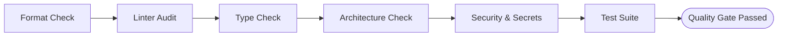

# Code Quality Engineering Manual

This document details the multi-layered automated verification system enforcing code quality, architecture integrity, and security across the codebase.

---

## 1. Unified Quality Command

Developers and AI Agents do not need to memorize multiple disconnected commands. A single unified entry point orchestrates the full verification pipeline:

```bash
# Node.js NPM Script
npm run quality

# Linux / macOS Bash Wrapper
./scripts/quality.sh

# Windows PowerShell Wrapper
.\scripts\quality.ps1
```

The unified command runs all six verification tiers sequentially, halting on the first failure and providing targeted, actionable root-cause diagnostics for immediate resolution.

---

## 2. Verification Layers & Execution Guide



### 2.1 Code Formatting Layer
Standardizes layout, indentation, quotes, import sorting, and bracket placement to prevent stylistic debates.

- **Check Formatting (Read-Only):**
  ```bash
  npm run format:check
  ```
- **Auto-Format Code:**
  ```bash
  npm run format
  ```
- **Tool Choice:** **Biome**
  - *Rationale:* Written in Rust, Biome formats files 25-50x faster than Prettier, natively supports TypeScript, and handles import organization out of the box with zero external configuration friction.

### 2.2 Static Linting & Antipattern Detection
Detects unreachable code, excessive complexity, unused variables, and suspicious language constructs.

- **Run Linter:**
  ```bash
  npm run lint
  ```
- **Auto-Fix Safe Lint Issues:**
  ```bash
  npm run lint:fix
  ```
- **Tool Choice:** **Biome Linter**
  - *Rationale:* Zero-overhead AST analysis, strict recommended rule presets, instant feedback loop (< 100ms across thousands of lines).

### 2.3 Strict Type Checking Layer
Eliminates runtime type errors, null reference crashes, and implicit coercion bugs before code execution.

- **Run Type Check:**
  ```bash
  npm run typecheck
  ```
- **Tool Choice:** **TypeScript Compiler (`tsc --noEmit`)**
  - *Configuration Highlights:*
    - `strict: true`
    - `noImplicitAny: true`
    - `strictNullChecks: true`
    - `noUncheckedIndexedAccess: true`
    - `exactOptionalPropertyTypes: true`
  - *Rule:* Bypassing types using `any` or unchecked type casts is strictly forbidden.

### 2.4 Architecture & Dependency Direction Layer
Enforces clean architectural boundaries and detects circular dependencies in the import graph.

- **Run Architecture Check:**
  ```bash
  npm run arch:check
  ```
- **Tool Choice:** **Custom Deterministic Graph Analyzer (`scripts/arch-check.mjs`)**
  - *Enforced Inward Dependency Rules:*
    - `src/domain` → Dependencies: **None** (Pure business logic)
    - `src/application` → Dependencies: `src/domain` only
    - `src/infrastructure` → Dependencies: `src/domain`, `src/application`
    - `src/presentation` → Dependencies: `src/application`, `src/domain`
  - *Circular Import Detection:* Uses depth-first cycle traversal on the module dependency graph.
  - *God File Prevention:* Flags any source file exceeding **400 lines of code**.

### 2.5 Security, Secret Detection & Error Handling Layer
Scans for accidental secret leaks, credential patterns, and destructive error-swallowing anti-patterns.

- **Run Security Scan:**
  ```bash
  npm run security:check
  ```
- **Enforced Security Patterns:**
  - **No Empty Catch:** Rejects `catch (e) {}` and `except: pass`.
  - **No Silent Null Returns:** Rejects `catch (e) { return null; }`.
  - **Secret Detection:** Scans for high-entropy tokens, generic API keys, and JWT headers (`.gitleaks.toml` / Semgrep).
  - **No `any` Type Casts:** Enforces domain-specific types.

### 2.6 Automated Test Suite Layer
Ensures behavioral correctness, domain invariants, and protects against regression defects.

- **Run All Tests:**
  ```bash
  npm run test
  ```
- **Run Unit Tests Only:**
  ```bash
  npm run test:unit
  ```
- **Run Integration Tests Only:**
  ```bash
  npm run test:integration
  ```
- **Run Governance Tests Only:**
  ```bash
  npm run test:governance
  ```
- **Tool Choice:** **Node.js Native Test Runner (`node --test`)**
  - *Rationale:* Zero external dependencies, ultra-fast parallel test execution, native ES module support.

---

## 3. Tool Selection Justification Summary

| Layer | Selected Tool | Alternative Considered | Primary Decision Factor |
| :--- | :--- | :--- | :--- |
| **Formatter** | Biome Formatter | Prettier | 30x faster runtime, unified toolchain |
| **Linter** | Biome Linter | ESLint | Zero-config TypeScript support, instant AST checks |
| **Type Checker** | TypeScript (`tsc`) | None | Canonical static type system for modern TS |
| **Architecture** | `scripts/arch-check.mjs` | `dependency-cruiser` | Instant native execution, zero heavy dependencies |
| **Security** | `scripts/security-check.mjs` | Gitleaks / Snyk | Fast local pre-commit check, enforces error handling |
| **Test Runner** | Native `node --test` | Vitest / Jest | Built into runtime, zero startup overhead |

---

## 4. Quality Gate Configuration (`config/quality-gate.json`)

The thresholds defined in `config/quality-gate.json` are non-negotiable:

- **Format Violations Permitted:** `0`
- **Lint Errors / Warnings Permitted:** `0`
- **Type Checking Errors Permitted:** `0`
- **Architecture Layer Violations Permitted:** `0`
- **Circular Dependencies Permitted:** `0`
- **Hardcoded Secrets Permitted:** `0`
- **Empty Catch Blocks Permitted:** `0`
- **Test Suite Pass Percentage:** `100.0%`
- **Maximum Function Length:** `50 lines`
- **Maximum File Length (God File limit):** `400 lines`

