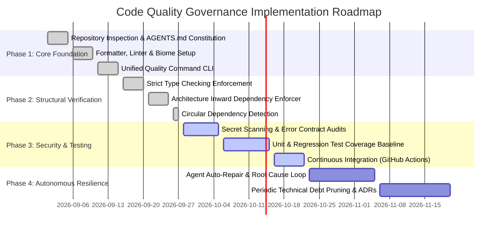

# Code Quality Governance & Agent Implementation Plan

This document establishes the strategic, phased implementation roadmap for establishing automated code quality governance across AI Coding Agents and engineering teams.

---

## 1. Executive Summary & Problem Diagnosis

Unconstrained "Vibe Coding" introduces subtle, compounding degradation:
- Disparate code styling across agent iterations.
- Duplicate helper modules, services, and DTOs.
- Monolithic "God files" (> 1,000 lines) created because the agent appends logic to existing files.
- Circular dependencies and cross-layer violations.
- Silent error swallowing (`catch (e) {}`) and loss of error visibility.
- Accumulation of patch-on-patch workarounds without root-cause remediation.

### The Governance Target
Build an automated engineering harness such that:
> **AI Coding Agents can rapidly innovate, but the automated pipeline deterministically rejects degraded code and guides the agent through an autonomous self-repair loop.**

---

## 2. Current State vs. Target State Assessment

| Capability Layer | Baseline State (Pre-Governance) | Target State (Governed System) | Status |
| :--- | :--- | :--- | :--- |
| **Code Formatting** | Inconsistent across agents, formatting disputes | Deterministic auto-formatting (Biome / Prettier) | ✅ Implemented |
| **Static Linting** | Minimal or unenforced; dead code accumulation | Strict lint rules; complexity &amp; antipattern blocks | ✅ Implemented |
| **Type Checking** | Loose types, pervasive `any`, unchecked casts | Strict type checking, no `any` escape hatches | ✅ Implemented |
| **Architecture Boundaries** | Uncontrolled cross-layer coupling | Layer boundary enforcement &amp; cycle detection | ✅ Implemented |
| **Security &amp; Secrets** | Hardcoded test tokens, silent catches | Automated secret scan &amp; error contract audit | ✅ Implemented |
| **Automated Testing** | Sparse tests, tests deleted when breaking | Mandatory unit &amp; regression tests, 100% pass | ✅ Implemented |
| **Quality Gate** | Manual review only, easy to bypass | Automated blocking gate in CLI and CI | ✅ Implemented |
| **Agent Constitution** | None or fragmented prompts | Unified `AGENTS.md` with automated SSOT sync | ✅ Implemented |

---

## 3. Polyglot Tool Selection Matrix

The governance architecture is language-agnostic. Below is the recommended tool selection matrix matching ecosystem maturity and performance:

| Language Ecosystem | Formatter | Linter | Type Checker | Architecture Enforcement | Security &amp; Secrets | Test Framework |
| :--- | :--- | :--- | :--- | :--- | :--- | :--- |
| **TypeScript / Node.js** | Biome / Prettier | Biome / ESLint | `tsc` (Strict) | Custom AST / `dependency-cruiser` | Gitleaks / Semgrep | Node Test / Vitest |
| **Python** | Ruff Format / Black | Ruff / Pylint | Pyright / mypy | `import-linter` | Gitleaks / Bandit | pytest |
| **Java / Kotlin** | Spotless | Checkstyle / PMD | `javac` / `kotlinc` | ArchUnit | Gitleaks / Semgrep | JUnit 5 / AssertJ |
| **Go** | `gofmt` | `golangci-lint` | Go Compiler / `go vet`| Custom package rules | `govulncheck` / Gitleaks | `go test` |
| **Rust** | `rustfmt` | Clippy | `rustc` (Compiler) | Module visibility (`pub(crate)`) | `cargo audit` / Gitleaks | `cargo test` |
| **C# / .NET** | `dotnet format` | Roslyn Analyzers | Roslyn Compiler | NetArchTest | Gitleaks / Snyk | xUnit / NUnit |

---

## 4. Phased Implementation Roadmap

### Phase 1: Core Foundation & Agent Constitution
- Establish `AGENTS.md` as the single source of truth.
- Deploy the automated Rule Sync Engine (`scripts/rule-sync.mjs`) targeting Claude Code, Cursor, Copilot, Gemini, and Windsurf.
- Implement high-speed formatting and linting via Biome.

### Phase 2: Structural & Architectural Verification
- Enforce strict typing (`strict: true`, `noImplicitAny: true`, `strictNullChecks: true`).
- Deploy `scripts/arch-check.mjs` to continuously validate the Inward Dependency Rule:
  `domain` -> `application` -> `infrastructure` & `presentation`.
- Enforce automated detection of cyclic dependencies.

### Phase 3: Security, Error Handling & Continuous Integration
- Deploy `scripts/security-check.mjs` and `config/semgrep/rules.yml` to forbid empty catch blocks and hardcoded tokens.
- Mandate unit tests for business domain entities and application use-cases.
- Wire all verification stages into `.github/workflows/quality.yml`.

### Phase 4: Autonomous Resilience & Technical Debt Pruning
- Embed the autonomous repair loop runner (`scripts/verify-fix-loop.mjs`).
- Regularly execute automated refactoring to eliminate dead compatibility shims and God files.
- Document architectural tradeoffs in Architecture Decision Records (`docs/adr/`).

---

## 5. Risk Assessment & Mitigation Matrix

| Risk Scenario | Impact | Mitigation Strategy |
| :--- | :--- | :--- |
| **Agent Disables Checks to Force CI Green** | High | Quality gate script strictly audits configuration files; any deletion of rules fails verification. |
| **Agent Adds Blanket Ignore Comments** | High | Security scanner scans source code for `ignore` comments; forbids unexplained suppressions. |
| **Huge Legacy Codebase Triggers 1,000+ Violations** | Medium | Establish a **Baseline File Policy**: existing legacy debt is cataloged, but all new code must achieve 100% compliance. |
| **Tool Execution Slows Down Agent Iterations** | Medium | Use sub-second native tooling (Biome, lightweight AST parser) providing total verification in < 3 seconds. |

