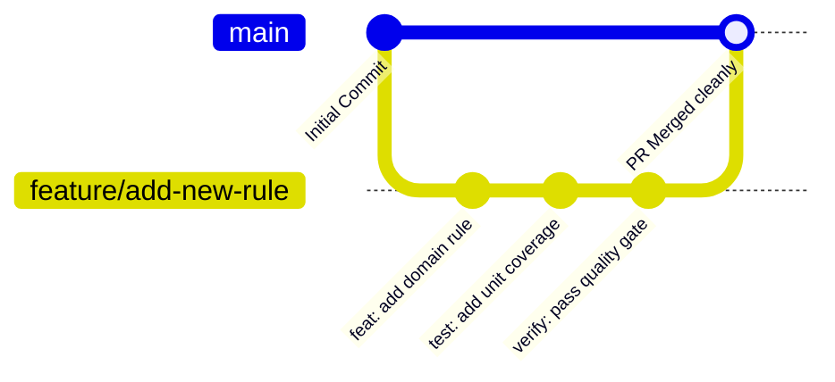

# Contributing to Vibe Coding Governance

We welcome contributions from human engineers and autonomous AI agents alike. To preserve repository architecture, type safety, and reliability, all contributions must strictly adhere to the standards outlined below.

---

## 1. Development & Branching Workflow



1. **Branch Naming**:
   - Features: `feature/<short-description>`
   - Bug Fixes: `fix/<short-description>`
   - Refactor: `refactor/<short-description>`
   - Documentation: `docs/<short-description>`
2. **Never commit directly to `main`**. Always work on a branch and submit a Pull Request.

---

## 2. Commit Message Guidelines (Conventional Commits)

Commit messages must follow the [Conventional Commits](https://www.conventionalcommits.org/) specification:

```text
<type>(<optional scope>): <description>

[optional body]

[optional footer(s)]
```

### Common Types:
- `feat`: A new feature or rule capability.
- `fix`: A bug fix or defect remediation.
- `refactor`: Code restructuring without changing observable behavior.
- `test`: Adding or correcting tests.
- `docs`: Documentation updates or ADR additions.
- `chore`: Routine tooling or dependency updates.

---

## 3. Mandatory Pre-Commit Quality Gate

Before pushing commits or opening a Pull Request, **all automated verification checks must pass**:

```bash
# Run the complete quality verification suite
npm run quality

# Or via wrapper scripts
./scripts/quality.sh
.\scripts\quality.ps1
```

Any Pull Request that fails CI checks will be blocked automatically.

---

## 4. Pull Request Checklist

When opening a Pull Request, ensure that:

- [ ] All code conforms to `AGENTS.md` and `ARCHITECTURE.md`.
- [ ] No circular dependencies or illegal layer imports were introduced (`npm run arch:check`).
- [ ] TypeScript compiles cleanly with zero errors under strict mode (`npm run typecheck`).
- [ ] Formatting and lint checks pass cleanly with zero warnings (`npm run format:check && npm run lint`).
- [ ] Security audit reports zero hardcoded credentials and zero empty catch blocks (`npm run security:check`).
- [ ] New business logic is covered by unit tests; bug fixes include regression tests (`npm run test`).
- [ ] `npm run rule:sync` was executed if `AGENTS.md` was modified.

