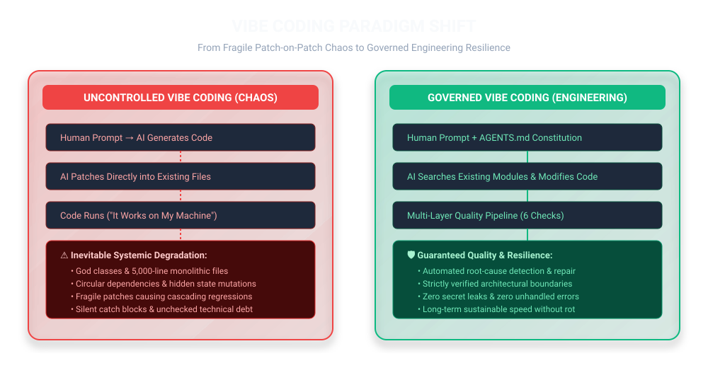
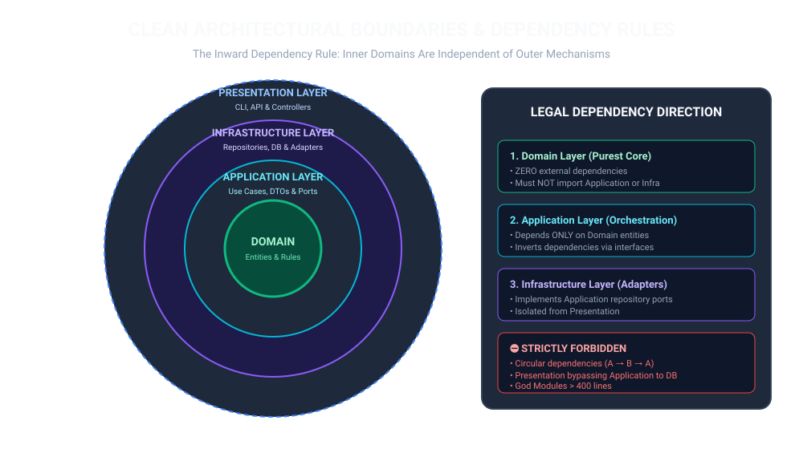
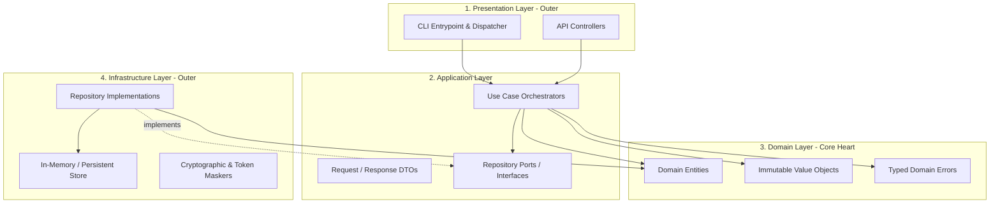
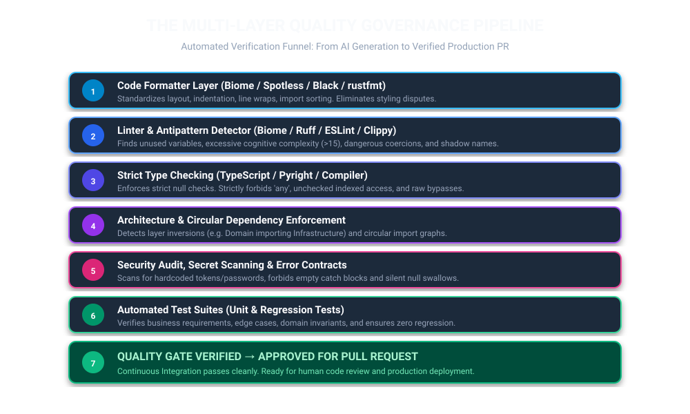
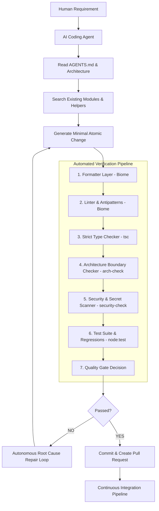
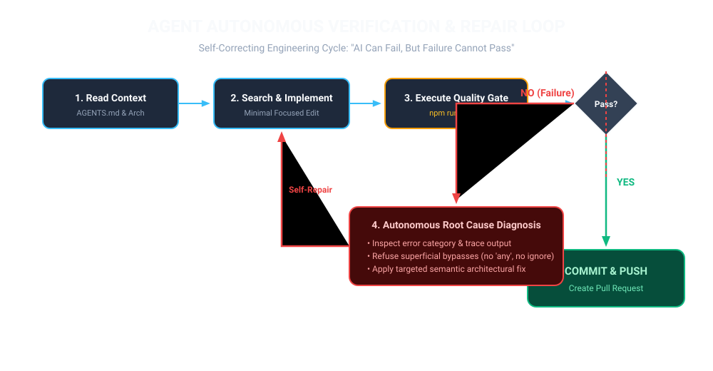
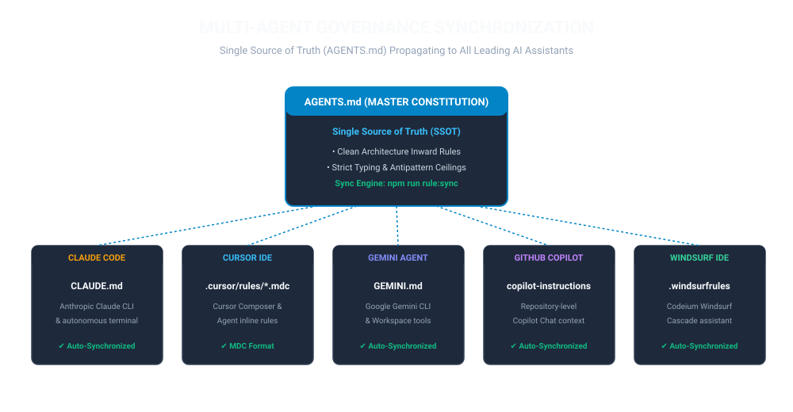

# Universal Vibe Coding Code Quality Governance & Autonomous Agent Enforcement Framework

[English](README.md) | [简体中文](README.zh-CN.md)

[](#7-quick-start--unified-quality-commands)
[](https://www.typescriptlang.org/)
[](https://biomejs.dev/)
[](#2-clean-architecture-and-inward-dependency-rules)
[](LICENSE)

> **Core Philosophy:** *AI coding agents are free to generate functionality rapidly, but are strictly prohibited from degrading project architecture, safety, or code quality.*

---

## 1. Problem Statement: The Reality of Uncontrolled Vibe Coding

Generative AI coding tools (OpenAI Codex, Claude Code, Cursor, Copilot, Gemini, Windsurf) have supercharged feature development speed. However, unconstrained "Vibe Coding" creates compounding, catastrophic architectural decay:

- **Style Disparity:** Uncoordinated formatting choices across agent sessions, causing perpetual diff noise.
- **Duplicate Abstractions:** Agents creating redundant helpers, services, validators, and mappers rather than searching existing modules.
- **God Modules & Classes:** Agents continuously appending logic to existing files, creating 5,000-line monolithic files.
- **Circular Dependencies & Layer Bleed:** Rapid prototyping causing tangled import graphs and cross-layer coupling (e.g. presentation directly touching databases).
- **Patch-on-Patch Workarounds:** Masking symptoms by adding `if` ladders without addressing root-cause domain invariants.
- **Silent Error Swallowing:** Pervasive `catch (e) {}`, `except: pass`, or returning `null` on failure, destroying failure visibility.
- **Type System Evasion:** Indiscriminate use of `any`, unchecked type assertions, and suppressed warnings to force CI green.



This framework transforms development from **hope-based vibe coding** to **resilient automated engineering**:
> **Do not expect AI agents to always write pristine code on the first attempt. Instead, build an automated engineering system that deterministically detects defects and guides the agent to repair them autonomously.**

---

## 2. Clean Architecture and Inward Dependency Rules

The codebase adheres strictly to **Clean Layered Architecture (Ports & Adapters)**.



### Dependency Rules:
| Layer | Directory | Allowed Dependencies | Primary Responsibility |
| :--- | :--- | :--- | :--- |
| **Domain** | `src/domain/` | **None** (Zero outer imports) | Pure business entities, value objects, domain errors, repository ports. |
| **Application** | `src/application/` | `src/domain/` | Orchestrating use cases, DTOs, repository port interfaces. |
| **Infrastructure** | `src/infrastructure/` | `src/domain/`, `src/application/` | Implementing repository ports, persistence, security utilities. |
| **Presentation** | `src/presentation/` | `src/application/`, `src/domain/` | CLI dispatchers, API controllers, argument parsers. |




---

## 3. Multi-Layer Quality Verification Pipeline

The framework deploys a 6-stage automated verification funnel. Code must pass through every stage sequentially before it is permitted to merge:



### Verification Pipeline Flow:



1. **Code Formatter Layer (Biome):** Standardizes indentation, line wraps, import sorting, and layout. Eliminates all styling disputes.
2. **Linter & Antipattern Layer (Biome):** Detects dead code, cognitive complexity (> 12), deep nesting (> 2 levels), and dangerous coercions.
3. **Strict Type Checking Layer (TypeScript `tsc`):** Enforces strict null safety. Forbids `any` escape hatches.
4. **Architecture Boundary Layer (`scripts/arch-check.mjs`):** Enforces the Inward Dependency Rule and prohibits circular dependency cycles.
5. **Security & Safe Error Handling Layer (`scripts/security-check.mjs`):** Detects hardcoded credentials, secret tokens, and forbids empty catch blocks.
6. **Automated Test Suite (`node:test`):** Executes unit tests and regression tests ensuring domain invariants hold.
7. **Quality Gate Decision Matrix:** Hard blocking threshold enforcing zero tolerance for regressions.

---

## 4. Agent Autonomous Verification & Auto-Repair Loop

When a quality gate check fails, the framework prevents superficial bypasses and triggers the **Autonomous Repair Loop**:



```text
while quality_checks_failed:
    inspect_diagnostic_failure()
    identify_root_cause()
    refuse_bypasses(no_any, no_ignore, no_test_deletion)
    modify_code_structure()
    rerun_quality_pipeline()
```

### Strict Repair Rules for AI Agents:
- ❌ **Forbidden:** Adding `biome-ignore`, `eslint-disable`, or `type: ignore` to bypass warnings.
- ❌ **Forbidden:** Casting variables to `any` to appease the type checker.
- ❌ **Forbidden:** Deleting or commenting out failing test assertions to pass CI.
- ❌ **Forbidden:** Adding another superficial `if` condition to patch symptoms without root cause analysis.
- ✅ **Required:** Fix the underlying domain model, interface contract, or boundary violation.

---

## 5. Multi-Agent Rule Synchronization (SSOT)

To prevent rule drift across disparate development environments, `AGENTS.md` acts as the **Single Source of Truth (SSOT)**.



Running `npm run rule:sync` propagates all constitutional constraints into:
- `CLAUDE.md` (Claude Code / Anthropic agents)
- `GEMINI.md` (Gemini CLI / Google agents)
- `.cursor/rules/vibe-governance.mdc` (Cursor IDE ambient context)
- `.github/copilot-instructions.md` (GitHub Copilot repository rules)
- `.windsurfrules` (Windsurf IDE cascade rules)

---

## 6. AI Agent Skill Packaging & Invocation

This framework is packaged as an automated **Codex Skill** (`skills/vibe-coding-governance/SKILL.md`) and multi-agent CLI tool.

### 6.1 Invoking in Codex
Mention the skill directly in any Codex conversation:
```text
$vibe-coding-governance Implement user session expiration and verify all quality gates.
```

### 6.2 Invoking via CLI Runner
AI agents and developers can execute the governance skill directly:
```bash
# Audit repository governance compliance score
npm run skill:audit
# or: node scripts/invoke-skill.mjs audit

# Run complete verification gate with structured agent diagnostic output
npm run skill:verify
# or: npx vibe-governance verify

# Synchronize AGENTS.md across Claude, Cursor, Copilot, Gemini, and Windsurf
npm run rule:sync
```

See [SKILL_INTEGRATION_GUIDE.md](docs/SKILL_INTEGRATION_GUIDE.md) for full integration procedures across all AI agents.

---

## 7. Quick Start & Unified Quality Commands

### 7.1 Installation
```bash
# Clone the repository
git clone https://github.com/pinzhuo0905-rgb/vibe-coding-governance.git
cd vibe-coding-governance

# Install dependencies
npm install
```

### 7.2 Execute Unified Quality Verification
A single unified command executes all verification tiers:

```bash
# Run complete verification gate (NPM)
npm run quality

# Or run via cross-platform shell wrappers:
./scripts/quality.sh     # Linux / macOS
.\scripts\quality.ps1   # Windows PowerShell
```

### 7.3 Granular Commands
```bash
npm run format           # Auto-format all source, test, and script files
npm run format:check     # Check formatting without writing
npm run lint             # Run static linter and antipattern checks
npm run lint:fix         # Auto-fix safe linter warnings
npm run typecheck        # Strict TypeScript compiler verification
npm run arch:check       # Validate layer boundaries and circular dependencies
npm run security:check   # Scan for hardcoded credentials and empty catches
npm run test             # Run complete unit, integration, and governance tests
npm run rule:sync        # Synchronize AGENTS.md across all AI agent targets
npm run generate:diagrams # Generate standalone vector SVG diagrams
```

---

## 8. Definition of Done (DoD)

A task is strictly considered **Done** only when:

1. [x] **Format PASS:** Code satisfies Biome formatter specifications.
2. [x] **Lint PASS:** Zero linter warnings or errors.
3. [x] **Type Check PASS:** TypeScript compiles under strict mode with zero `any` types.
4. [x] **Architecture PASS:** Zero boundary violations and zero circular dependencies.
5. [x] **Security PASS:** Zero hardcoded secrets and zero empty catch blocks.
6. [x] **Tests PASS:** 100% test pass rate with coverage for newly added logic.
7. [x] **SSOT Sync PASS:** `npm run rule:sync` verified with zero drift.

---

## 9. License

This project is licensed under the **MIT License**.

