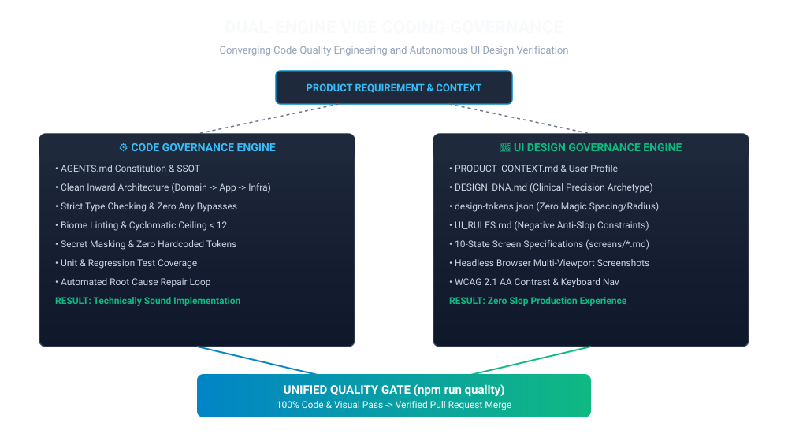
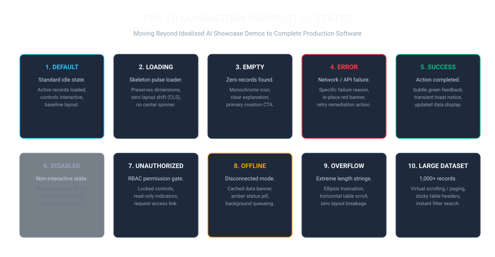

# Universal Vibe Coding Code & UI Design Governance

[](scripts/verify-fix-loop.mjs)
[](UI_RULES.md)
[](design/design-tokens.json)
[](ARCHITECTURE.md)
[](tsconfig.json)
[](LICENSE)
[](README.zh-CN.md)

> **Universal Engineering Constitution & Autonomous Quality Pipeline:** Empower AI agents (OpenAI Codex, Claude Code, Cursor, Copilot, Gemini, Windsurf) to rapidly create software without degrading software architecture, safety, or user interface elegance.

---

## 1. Dual-Engine Governance Paradigm

Traditional Vibe Coding treats AI as a black box: prompt in, code out. If it builds, it ships. This naive loop leads to catastrophic architectural rot in code and generic "AI Slop" in user interfaces.

This framework introduces a **Dual-Engine Governance Model**, unifying deterministic code quality engineering with autonomous visual design verification.



---

## 2. Why "AI Slop" Plagues AI UI Design

When developers prompt: *"Create a modern, clean, premium dashboard"*, the LLM receives near-zero structural context. Consequently:
1. **Convergence to Internet Averages:** The AI defaults to high-probability Tailwind classes: purple-to-blue gradients, gradient text, glowing card borders, and oversized headers.
2. **Risk-Avoidance Heuristics:** Asymmetric layouts, dense data grids, and subtle typography carry higher generation failure risks. The model retreats to safe, generic card grids.
3. **Missing Product Context:** Without explicit knowledge of user expertise, daily session duration, and high-frequency tasks, the AI assumes every page is a consumer marketing showcase.
4. **Uncalibrated Component Defaults:** Off-the-shelf components from libraries (shadcn/ui, Radix, MUI) are combined with default paddings and radiuses, creating generic library demo aesthetic.

### The Solution: Engineering the Design System

The antidote to AI Slop is not a better prompt—it is **converting product context, design personality, spatial tokens, screen specifications, and headless browser evidence into permanent repository assets.**


---

## 3. Evidence-Based Visual Repair Loop

Never trust source code or JSX as visual evidence. A build pass only proves technical syntax—it does not prove usability, contrast, or responsiveness.

Every UI modification triggers an autonomous verification cycle:


1. **Spec-First:** Agent ingests `PRODUCT_CONTEXT.md`, `DESIGN_DNA.md`, and `screens/<name>.md`.
2. **Implementation:** Generates code adhering strictly to `design/design-tokens.json`.
3. **Browser Render:** Launches headless Chrome/Edge against the live page.
4. **Screenshot Capture:** Captures high-fidelity snapshots at Desktop (1440x900), Tablet (768x1024), and Mobile (375x812).
5. **Multi-Dimensional Review:** Audits anti-slop rules, WCAG 2.1 AA contrast, and state completeness.
6. **Autonomous Repair:** If any check fails, the agent diagnoses root causes and refactors until 100% green.

---

## 4. The 10 Mandatory Product UI States

AI prototypes notoriously design only the *Ideal State* (data present, no errors). Professional software requires 10 distinct operational states:



| State | Engineering & Visual Contract |
| :--- | :--- |
| **1. Default** | Steady-state view with live records, full interactivity, and baseline spatial rhythm. |
| **2. Loading** | Structured skeleton pulse loaders matching destination geometry (zero CLS, no generic center spinners). |
| **3. Empty** | Zero records found. Monochrome geometric icon, actionable explanation, and creation CTA. |
| **4. Error** | Network/API failure. Descriptive diagnostic banner in-place with retry remediation. |
| **5. Success** | Action confirmed. Transient toast notice, updated data table, subtle emerald feedback. |
| **6. Disabled** | Non-interactive. Reduced opacity (0.45), `not-allowed` cursor, explanatory tooltip. |
| **7. Unauthorized** | RBAC permission gate. Locked controls, read-only indicators, access request trigger. |
| **8. Offline** | Disconnected mode. Local cache indicator banner, background sync queue. |
| **9. Overflow** | Extreme long strings (64+ chars). Clean ellipsis truncation without breaking grid layout. |
| **10. Large Dataset**| 1,000+ records. Virtual scrolling / compact pagination, sticky table headers, instant search filter. |

---

## 5. Architectural Clean Boundaries (Code Engine)

Code quality is enforced via strict Clean Architecture inward dependencies:


- **Domain Layer:** Pure business logic, entities, value objects, domain errors. Zero external dependencies.
- **Application Layer:** Use-cases and DTOs. Depends only on Domain.
- **Infrastructure Layer:** Persistence, adapters, security token masking. Implements Application port interfaces.
- **Presentation Layer:** CLI commands, UI views, controllers. Consumes Application use-cases.

---

## 6. Synthesis of Leading Prior Art

Rather than chaining disparate external plugins, this framework distills the highest-leverage insights from top community systems:

| System / Pioneer | Core Philosophy Extracted | Implementation in This Framework |
| :--- | :--- | :--- |
| **no-slop-ui** | Negative Constraint Design | [UI_RULES.md](UI_RULES.md) Anti-Slop negative guardrails & AST regex linter. |
| **skill-web-design** | Design DNA & Personality | [DESIGN_DNA.md](DESIGN_DNA.md) Clinical Precision archetype & density scale. |
| **xiaopu-ai/web-design** | Spec-First UI Engineering | Mandatory [DESIGN.md](DESIGN.md) & [screens/*.md](design/screens/) before coding. |
| **ui-design-cc** | Structured Machine Tokens | [design/design-tokens.json](design/design-tokens.json) enforcing 4px spatial rhythm. |
| **Agentic Design System** | Evidence-Based Verification | Headless browser execution capturing multi-viewport screenshots. |
| **claude-web-design-skills** | Visual Inspection Repair Loop | Autonomous loop: `Render -> Capture -> Review -> Repair -> Verify`. |

---

## 7. Repository Structure

```text
vibe-coding-governance/
├── AGENTS.md                                   # Master Agent Constitution (SSOT)
├── CLAUDE.md / GEMINI.md / .windsurfrules     # Auto-synced agent-specific rule files
├── .cursor/rules/vibe-governance.mdc           # Cursor IDE rule asset
├── UI_DESIGN_GOVERNANCE_IMPLEMENTATION_SPEC.md# Step-by-step agent implementation runbook
├── PRODUCT_CONTEXT.md                          # Product positioning, personas, density profile
├── DESIGN_DNA.md                               # Clinical Precision archetype & visual register
├── DESIGN.md                                   # Complete visual design specification
├── UI_RULES.md                                 # Anti-Slop negative constraints & positive rules
├── UI_REVIEW.md                                # 6-dimensional review & acceptance criteria
│
├── design/
│   ├── design-tokens.json                      # Machine-readable tokens (colors, space, radius)
│   ├── COMPONENTS.md                           # Inventory of 13+ standardized core components
│   ├── screens/                                # 10-state screen specifications
│   │   ├── dashboard.md                        # Primary developer dashboard spec
│   │   ├── login.md                            # Enterprise SSO & auth spec
│   │   ├── settings.md                         # Policy & threshold configuration spec
│   │   └── api-keys.md                         # Agent credential & vault spec
│   └── references/
│       └── design-archetypes.md                # Reference archetypes catalog
│
├── screenshots/                                # Real headless browser visual evidence
│   ├── desktop/dashboard-1440x900.png          # Desktop viewport capture
│   ├── tablet/dashboard-768x1024.png           # Tablet viewport capture
│   └── mobile/dashboard-375x812.png            # Mobile viewport capture
│
├── scripts/
│   ├── verify-fix-loop.mjs                     # Unified dual-engine quality gate runner
│   ├── ui-review.mjs                           # Automated anti-slop & state completeness linter
│   ├── design-token-check.mjs                  # Design token schema & boundary checker
│   ├── screenshot.mjs                          # Headless browser multi-viewport capture
│   ├── arch-check.mjs                          # Architecture dependency & cycle validator
│   ├── security-check.mjs                      # Secret scanner & error-handling auditor
│   └── rule-sync.mjs                           # Multi-agent rule synchronizer
│
├── src/                                        # Clean Architecture TypeScript codebase
│   ├── domain/                                 # Pure business entities & port interfaces
│   ├── application/                            # Quality evaluation use-cases & DTOs
│   ├── infrastructure/                         # In-memory persistence & token maskers
│   └── presentation/                           # CLI commands & pilot UI views
│       └── ui/pilot-dashboard.html             # Accessible, token-compliant pilot dashboard
│
└── tests/                                      # Unit, integration, & governance test suite
    ├── unit/                                   # Domain & use-case unit tests
    ├── integration/                            # End-to-end governance pipeline tests
    └── governance/                             # Arch, rule-sync, & design governance tests
```

---

## 8. CLI Commands & Quick Start

### Install Dependencies
```bash
npm install
```

### Execute the Unified Dual-Engine Quality Gate
Runs code formatting, static linting, strict typecheck, architecture boundaries, secret checks, design token validation, UI anti-slop linter, and full test suite:
```bash
npm run quality
```

### Individual Verification Commands
```bash
# Audit design tokens & spatial boundaries
npm run ui:tokens

# Scan UI files & screen specs for AI Slop violations
npm run ui:lint

# Capture real headless browser screenshots across viewports
npm run ui:screenshot

# Synchronize AGENTS.md rules across Claude, Cursor, Gemini, Copilot, Windsurf
npm run rule:sync

# Regenerate all high-definition English & Chinese SVG diagrams
npm run generate:diagrams

# Run unit, integration, and governance test suite
npm test
```

---

## 9. Definition of Done (DoD) Checklist

A feature, refactoring, or screen is **strictly rejected** unless all of the following pass:

- [ ] **Formatting (Biome):** `npm run format:check` returns 0 errors.
- [ ] **Linter (Biome):** `npm run lint` returns 0 errors and 0 warnings.
- [ ] **Strict Types (TSC):** `npm run typecheck` returns 0 compiler errors under strict mode.
- [ ] **Architecture Check:** `npm run arch:check` confirms zero illegal layer imports and zero cycles.
- [ ] **Security Scan:** `npm run security:check` confirms zero leaked credentials and safe error handling.
- [ ] **Design Token Conformance:** `npm run ui:tokens` confirms zero uncalibrated magic pixel values.
- [ ] **UI Anti-Slop Linter:** `npm run ui:lint` confirms zero gradient/glow/pill slop violations.
- [ ] **Multi-Viewport Evidence:** `npm run ui:screenshot` renders verified screenshots in `screenshots/`.
- [ ] **10-State Completeness:** Screen specification explicitly details all 10 states.
- [ ] **WCAG 2.1 AA:** Contrast >= 4.5:1, visible focus rings, full keyboard navigability.
- [ ] **Test Coverage:** `npm test` achieves 100% pass rate.
