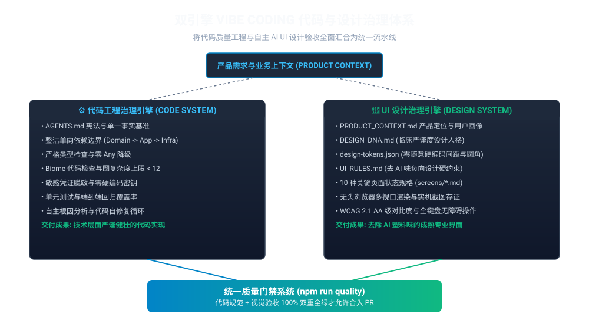
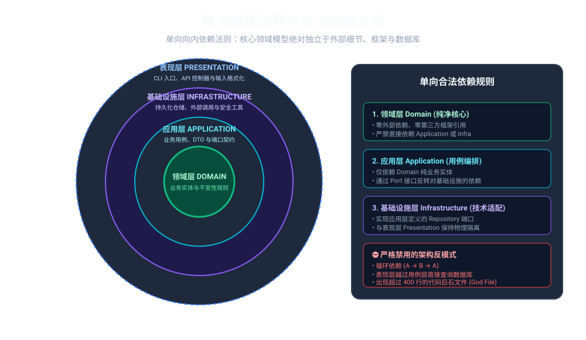

# Universal Vibe Coding 代码与 UI 设计双引擎工程治理框架

[](scripts/verify-fix-loop.mjs)
[](UI_RULES.md)
[](design/design-tokens.json)
[](ARCHITECTURE.md)
[](tsconfig.json)
[](LICENSE)
[](README.md)

> **通用工程开发宪法与自主闭环质量门禁体系：** 允许 AI Agent（OpenAI Codex、Claude Code、Cursor、GitHub Copilot、Gemini、Windsurf）高速生成功能，但通过机器级硬约束严禁其破坏代码整洁架构、安全性与用户界面工程专业度。

---

## 1. 双引擎治理范式 (Dual-Engine Paradigm)

传统的 Vibe Coding 开发模式往往将 AI 视为黑盒：“提问 -> 生成代码 -> 能够编译 -> 直接上线”。这种粗放模式在工程代码层面会导致严重的架构腐蚀与循环依赖；而在前端 UI 界面层面，则会导致充斥着紫蓝渐变、发光边框、卡片套娃和虚假 KPI 的**“AI 塑料味 (AI Slop)”**。

本项目建立了**双引擎治理模型 (Dual-Engine Governance Model)**，将确定性的底层代码质量工程与自主的视觉设计工程验收融为一体：



---

## 2. 为什么 AI 设计的界面充满“AI 塑料味”？

当开发者对 AI 说：*“做一个现代、简洁、高级的后台 Dashboard”* 时，大语言模型实际获取到的有效业务上下文几乎为零。其深层成因包括：

1. **AI 默认收敛至互联网设计平均值：** 在缺乏约束时，模型只能依赖训练数据中最高频的组合——紫蓝渐变背景、渐变文字、大圆角、玻璃拟态与巨大字号。
2. **AI 的风险规避偏好：** 极高信息密度、不对称排版与克制排版容易生成失败；AI 会本能避开风险，退守到千篇一律的标准 4 个卡片 + 1 个图表布局。
3. **缺失产品业务上下文：** AI 不知道用户是谁、每天使用多久、是否需要高频扫描与极速操作，容易把长期使用的“生产力工具”做成一次性看的“营销宣传页”。
4. **组件库的默认组合泛滥：** 直接堆砌 Tailwind、shadcn/ui 或 MUI 的默认组件、默认间距与默认大圆角，产生浓厚的“组件库 Demo 感”。

### 解决之道：将设计全面工程化

去除 AI 味的核心不是写一段更长、更华丽的提示词，而是**将产品理解、设计人格 (Design DNA)、设计 Token、10 种关键页面状态以及真实的无头浏览器实机渲染存证，沉淀为项目内长期的确定性工程资产**。


---

## 3. 基于客观浏览器渲染存证的自修复循环

**绝对不要将源代码（JSX/HTML/CSS）当做视觉验收依据。** 编译通过（Build PASS）仅代表语法和技术层面可行，根本不能证明界面在实际屏幕上清晰好用、没有溢出、没有对比度缺陷。

所有 UI 界面的生成和修改，均必须触发自主闭环验证链路：


1. **规范先行 (Spec-First)：** Agent 必须先阅读 `PRODUCT_CONTEXT.md`、`DESIGN_DNA.md` 与当前页面的规格文档 `screens/<name>.md`。
2. **代码实现：** 严格遵循 `design/design-tokens.json` 中的间距、色板与圆角基准编写组件与样式。
3. **浏览器真实渲染：** 启动本地无头 Chrome / Edge 渲染目标页面。
4. **多端实机抓图：** 自动截取桌面端 (1440x900)、平板端 (768x1024) 和移动端 (375x812) 真实渲染图存证于 `screenshots/`。
5. **多维质量审查：** 执行 `npm run ui:lint` 自动扫描是否含有禁用的紫蓝渐变、发光阴影、胶囊按钮或缺少关键状态。
6. **自主定位与修复：** 若发现任何瑕疵，Agent 自主分析根因并重构修复代码，重新渲染验证，直到 100% 绿灯。

---

## 4. 软件产品必须具备的 10 种关键状态

AI 演示原型最容易犯的错误是只做“理想常态”（数据刚好、没有错误）。工业级生产力软件必须完整定义并实现 10 种交互状态：


| 状态类型 | 视觉表现与工程契约 |
| :--- | :--- |
| **1. 默认常态 (Default)** | 标准就绪状态。加载真实生产数据，所有交互控件正常可用，基准空间排版。 |
| **2. 骨架屏加载 (Loading)** | 严格维持目标元素几何尺寸的骨架屏占位（杜绝累积布局偏移 CLS，严禁全屏旋转菊花）。 |
| **3. 空数据 (Empty)** | 零记录或过滤无果。展示单色线框几何图标、明确的原因解释文案与新建引导主按钮。 |
| **4. 异常失败 (Error)** | 接口超时或鉴权失败。就地红色警示条，给出明确技术诊断原因与重试补救操作。 |
| **5. 成功反馈 (Success)** | 操作完成确认。瞬态吐司消息通知、视图数据就地更新、克制的高对比度绿色指示。 |
| **6. 禁用态 (Disabled)** | 业务条件不满足。透明度压低至 0.45、禁止点击光标样式 (`not-allowed`)，带提示解释气泡。 |
| **7. 无权限 (Unauthorized)** | RBAC 角色限制。敏感操作按钮加锁变灰，提供只读标识或权限申请快捷入口。 |
| **8. 离线态 (Offline)** | 脱机断网模式。顶部横幅提示展示本地缓存，操作进入后台同步队列。 |
| **9. 内容溢出 (Overflow)** | 64 字符以上超长字符串。文本安全省略号截断，表格支持横向独立滚动，绝对不撑破页面。 |
| **10. 海量数据 (Large Dataset)**| 1,000+ 条记录。虚拟滚动或紧凑分页，表头吸顶固定，毫秒级快速就地过滤。 |

---

## 5. 代码工程整洁架构边界 (Code Engine)

底层业务逻辑采用严格的整洁架构（Clean Architecture）单向依赖模型：



- **Domain 领域层（核心）：** 纯业务实体、值对象、领域异常与仓储接口，对外层和第三方库具有**零依赖**。
- **Application 应用层：** 协调用例逻辑与数据传输对象 (DTO)，仅依赖 Domain 层。
- **Infrastructure 基础设施层：** 内存持久化、配置注入器、敏感凭证脱敏器，实现应用层定义的接口。
- **Presentation 表现层：** 控制台 CLI 命令、前端 UI 视图页面，仅通过应用层用例驱动业务。

---

## 6. 优秀前人开源项目思想融合

本项目不盲目拼凑外部插件，而是吸收全球顶尖 AI 与设计工程前沿项目的核心精髓：

| 参考项目 / 流派 | 核心思想提取 | 本框架具体实现落地 |
| :--- | :--- | :--- |
| **no-slop-ui** | 负向硬约束设计法 | [UI_RULES.md](UI_RULES.md) 负向规则库与 AST 正则自动化审查器。 |
| **skill-web-design** | 设计人格与原型系统 (Design DNA) | [DESIGN_DNA.md](DESIGN_DNA.md) 确立“临床严谨型 (Clinical Precision)”高密度体系。 |
| **xiaopu-ai/web-design** | 规范先行工程法 (Spec-First) | 编码前强制编写 [DESIGN.md](DESIGN.md) 与 [页面规格文档](design/screens/)。 |
| **ui-design-cc** | 结构化机器 Design Token | [design/design-tokens.json](design/design-tokens.json) 锁定 4px 韵律，杜绝任意魔法数值。 |
| **Agentic Design System** | 基于浏览器存证的客观检验 | 无头浏览器自动多视口截图与多维审查矩阵。 |
| **claude-web-design-skills** | 视觉自修复流水线闭环 | `渲染 -> 截图 -> 审查 -> 诊断 -> 修复` 全自主循环。 |

---

## 7. 仓库完整目录架构

```text
vibe-coding-governance/
├── AGENTS.md                                   # AI Agent 行为宪章与单一事实基准 (SSOT)
├── CLAUDE.md / GEMINI.md / .windsurfrules     # 自动同步的各平台 Agent 规则映射
├── .cursor/rules/vibe-governance.mdc           # Cursor IDE 专用工程质量规则
├── UI_DESIGN_GOVERNANCE_IMPLEMENTATION_SPEC.md# Agent 实施任务书与施工说明书
├── PRODUCT_CONTEXT.md                          # 产品定位、目标用户、高频任务与密度策略
├── DESIGN_DNA.md                               # 临床严谨型原型设计人格与色板策略
├── DESIGN.md                                   # 完整视觉设计系统规范
├── UI_RULES.md                                 # 去 AI 味负向硬约束与正向设计准则
├── UI_REVIEW.md                                # 六维视觉与可用性验收标准
│
├── design/
│   ├── design-tokens.json                      # 机器可读的严格设计 Token（颜色、间距、圆角）
│   ├── COMPONENTS.md                           # 13+ 核心组件标准库规范
│   ├── screens/                                # 10 种关键状态完整的页面规格说明书
│   │   ├── dashboard.md                        # 开发者治理仪表盘页面规格
│   │   ├── login.md                            # 企业级统一鉴权与 SSO 页面规格
│   │   ├── settings.md                         # 门禁策略与阈值配置页面规格
│   │   └── api-keys.md                         # 智能体凭证与密钥保险库页面规格
│   └── references/
│       └── design-archetypes.md                # 常用专业设计原型参考库
│
├── screenshots/                                # 无头浏览器抓取的客观实机渲染图
│   ├── desktop/dashboard-1440x900.png          # 桌面端高清截图存证
│   ├── tablet/dashboard-768x1024.png           # 平板端截图存证
│   └── mobile/dashboard-375x812.png            # 移动端截图存证
│
├── scripts/
│   ├── verify-fix-loop.mjs                     # 双引擎统一质量门禁自修复运行器
│   ├── ui-review.mjs                           # 自动化去 AI 味与页面状态完整度检查器
│   ├── design-token-check.mjs                  # 设计 Token 结构完整性校验器
│   ├── screenshot.mjs                          # 无头浏览器多视口自动化实机截图工具
│   ├── arch-check.mjs                          # 架构单向依赖与循环依赖静态检查
│   ├── security-check.mjs                      # 密钥泄漏与安全异常处理静态检查
│   └── rule-sync.mjs                           # 多平台 Agent 规则自动化单向同步器
│
├── src/                                        # TypeScript 整洁架构工程源码
│   ├── domain/                                 # 纯业务实体与仓储接口
│   ├── application/                            # 质量评估用例与 DTO 数据传输对象
│   ├── infrastructure/                         # 内存仓储与凭证脱敏器
│   └── presentation/                           # CLI 控制台命令与试点 UI 界面
│       └── ui/pilot-dashboard.html             # 符合设计 Token 与 WCAG 标准的试点控制台
│
└── tests/                                      # 单元测试、集成测试与工程治理测试集
    ├── unit/                                   # 领域实体与用例单元测试
    ├── integration/                            # 端到端治理流水线测试
    └── governance/                             # 架构规则、规则同步与设计治理回归测试
```

---

## 8. 快速上手与常用 CLI 指令

### 安装依赖
```bash
npm install
```

### 执行统一双引擎质量门禁 (Unified Quality Gate)
一次性执行代码格式、静态检查、严格类型、架构依赖、安全密钥、设计 Token、UI 去塑料味检查以及全套测试：
```bash
npm run quality
```

### 专项检查与工具指令
```bash
# 校验 design-tokens.json 规范与圆角约束
npm run ui:tokens

# 扫描 UI 页面与规格文档中的 AI Slop 违规项与缺失状态
npm run ui:lint

# 调用本地无头 Chrome/Edge 截取桌面、平板与移动端渲染存证
npm run ui:screenshot

# 将 AGENTS.md 规则同步至 Cursor、Claude、Gemini、Copilot、Windsurf
npm run rule:sync

# 重新生成全套中英文高清架构矢量示意图 (SVG)
npm run generate:diagrams

# 执行单元测试与治理回归测试
npm test
```

---

## 9. 任务完成定义 (Definition of Done) 清单

在任何代码修改、功能新增或界面重构提交前，**必须 100% 满足以下各项门禁标准**：

- [ ] **代码格式 (Biome)：** `npm run format:check` 零格式错误。
- [ ] **代码检查 (Biome)：** `npm run lint` 零警告、零报错。
- [ ] **严格类型 (TSC)：** `npm run typecheck` 严格模式零类型错误，严禁使用 `any` 降级。
- [ ] **架构依赖检测：** `npm run arch:check` 验证零越层调用与零循环引用。
- [ ] **安全审计扫描：** `npm run security:check` 确认零敏感凭证泄露与异常吞噬。
- [ ] **设计 Token 对齐：** `npm run ui:tokens` 确认零未标定的魔法像素数值。
- [ ] **去 AI 味审查：** `npm run ui:lint` 确认零禁用渐变、零发光阴影、零无脑胶囊按钮。
- [ ] **多视口实机存证：** `npm run ui:screenshot` 成功在 `screenshots/` 抓取真实渲染图。
- [ ] **10 种状态齐备：** 页面规格与实现完整覆盖默认、骨架屏、空数据、异常失败等状态。
- [ ] **无障碍标准 (WCAG 2.1 AA)：** 文本对比度 >= 4.5:1，键盘焦点可见，支持 Tab 顺序导航。
- [ ] **全套测试回归：** `npm test` 实现 100% 测试通过率。

