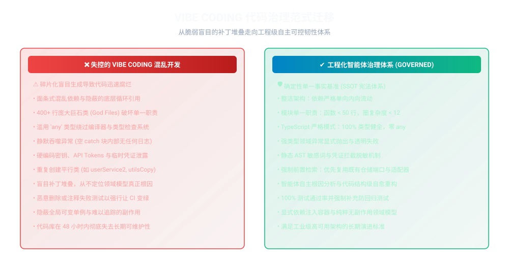
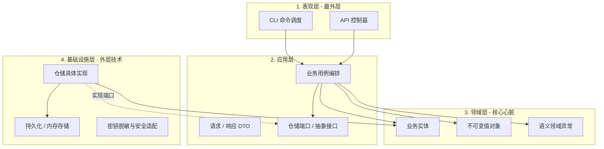
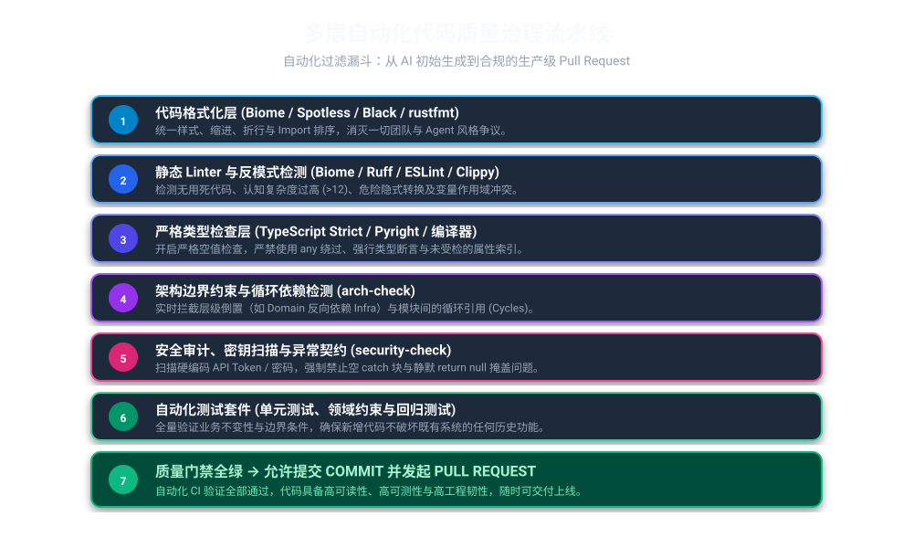
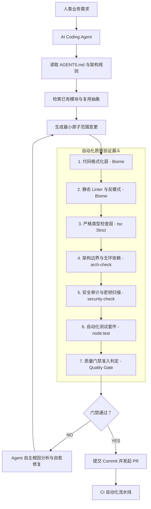
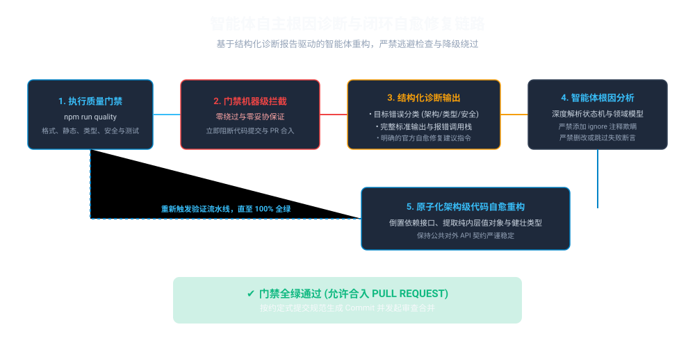
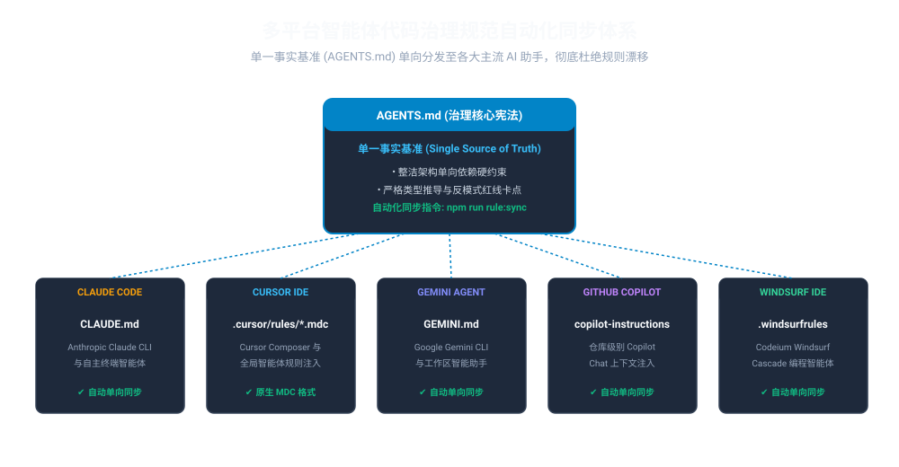

# 通用 Vibe Coding 代码质量治理与 Agent 自治执行框架

[English](README.md) | [简体中文](README.zh-CN.md)

[](#7-快速上手与统一质量命令)
[](https://www.typescriptlang.org/)
[](https://biomejs.dev/)
[](#2-整洁架构与单向向内依赖法则)
[](LICENSE)

> **核心哲学：** *AI Coding Agent 可以自由、快速地实现业务功能，但绝不能自由地破坏项目的架构边界、代码质量与安全性。*

---

## 1. 背景痛点：失控 Vibe Coding 的现实陷阱

当前生成式 AI 编程（OpenAI Codex、Claude Code、Cursor、GitHub Copilot、Gemini、Windsurf 等）极大地提升了功能开发效率。然而，如果缺乏工程约束，单纯依靠对话式“Vibe Coding”会导致系统迅速且不可逆地走向架构腐化：

- **代码风格严重撕裂：** 不同的 Agent 会话采用不同的缩进、换行和引用规范，引发无休止的代码审查争议。
- **重复造轮子与重复模块：** AI 缺乏全局感知，往往在新增需求时直接新建重复的 Helper、Validator、Mapper 或 Service。
- **God Class / God Module 恶性膨胀：** AI 倾向于“既然这个文件已有相关代码，就继续往里加”，导致单文件突破数千行。
- **循环依赖与跨层调用：** 表现层直接跨过业务逻辑查询底层数据库，模块之间形成 A → B → A 的死锁式循环依赖。
- **Patch 上的 Patch 恶性循环：** 修复缺陷时不排查根本原因，而是机械性地在外部增加一层又一层 `if` 补丁，破坏领域不变性。
- **异常静默吞没：** 到处充斥着 `catch (e) {}` 或 `catch (e) { return null; }`，彻底破坏了故障排查的可见性。
- **类型系统全面绕过：** 遇到类型报错时滥用 `any`、强行类型断言或添加忽略注释，使得编译期检查沦为摆设。



本治理框架的目标**不是要求 AI 每次都能单次写出完美代码**，而是建立一套工业级的自动化工程体系：
> **允许 AI 产生差错，但任何低质量、破坏架构、缺失测试或存在安全漏洞的代码，都绝不可能通过工程系统的准入门禁；系统将自动拦截并引导 AI 完成自我修复。**

---

## 2. 整洁架构与单向向内依赖法则

本仓库严格遵循**整洁架构（Clean Architecture / 端口与适配器模型）**规范：


### 分层约束规范：
| 层次结构 | 源码目录 | 允许的依赖方向 | 核心职责 |
| :--- | :--- | :--- | :--- |
| **领域层 (Domain)** | `src/domain/` | **零依赖** (严禁引入外部层) | 纯净业务实体、值对象、领域异常、仓储端口定义。 |
| **应用层 (Application)** | `src/application/` | `src/domain/` | 编排业务用例 (Use Cases)、数据传输 DTO、依赖倒置契约。 |
| **基础设施层 (Infrastructure)** | `src/infrastructure/` | `src/domain/`, `src/application/` | 实现应用层仓储端口、持久化存储、加密与安全工具。 |
| **表现层 (Presentation)** | `src/presentation/` | `src/application/`, `src/domain/` | CLI 调度器、REST 控制器、输入解析与终端格式化。 |




---

## 3. 多层自动化代码质量治理流水线

本框架构建了包含 6 个层级的自动化校验过滤漏斗，任何代码提交或合并前都必须依次通过校验：



### 核心校验流向图：



### 各层级职责与工具选型：
1. **代码格式化层 (Biome)：** 自动统一缩进、换行、折叠与 Import 排序，消灭一切人工格式争议。
2. **静态 Linter 与反模式层 (Biome)：** 拦截未使用死代码、复杂度过高 (>12)、过深嵌套 (>2 层) 与隐式遮蔽变量。
3. **严格类型检查层 (TypeScript `tsc` Strict)：** 强制开启严格空安全检查，严禁使用 `any` 绕过类型系统。
4. **架构边界与循环依赖层 (`scripts/arch-check.mjs`)：** 严格守护单向向内依赖规则，实时阻断任何层级越权与模块循环引用。
5. **安全审计与异常契约层 (`scripts/security-check.mjs`)：** 拦截硬编码 API Token、密钥泄漏，全面禁止空 catch 块与静默 return null。
6. **自动化测试与回归保障层 (`node:test`)：** 验证核心领域规则与边界情况，确保既有功能零回归。
7. **质量门禁准入矩阵 (`config/quality-gate.json`)：** 刚性阻断指标，零容忍违规项。

---

## 4. AI Agent 自主验证与自愈修复循环

当统一质量门禁被触发拦截时，框架会生成结构化的根因诊断指引，并驱动 Agent 运行自主自愈闭环：



```text
while quality_checks_failed:
    读取结构化诊断报告()
    定位问题根本原因 Root Cause()
    拒绝投机绕过(严禁加 any、严禁加 ignore 注释、严禁删除测试用例)
    实施架构级语义修复()
    重新执行统一门禁 quality()
```

### Agent 必须遵守的自愈底线：
- ❌ **严禁投机：** 禁止通过添加 `biome-ignore`、`eslint-disable` 或 `type: ignore` 注释来掩盖警告。
- ❌ **严禁绕过：** 禁止将报错变量强制断言为 `any` 来糊弄类型检查器。
- ❌ **严禁破坏：** 严禁为了通过 CI 而直接删除或注释掉报错的测试断言。
- ❌ **严禁盲目修补：** 严禁不查根因盲目在外部堆砌层层 `if` 逻辑。
- ✅ **必须正向修复：** 必须修正底层领域模型、重构接口契约或解耦不当依赖。

---

## 5. 多 Agent 规则同步系统 (Single Source of Truth)

为彻底解决多个 AI Agent（如 Cursor、Claude Code、GitHub Copilot 等）协同开发时规则分叉的问题，本框架确立 `AGENTS.md` 为**全局单一可信源 (SSOT)**。



运行 `npm run rule:sync` 即可将所有宪法级约束无损同步至：
- `CLAUDE.md` (Claude Code / Anthropic 专用规则)
- `GEMINI.md` (Google Gemini CLI 与 Agent 规则)
- `.cursor/rules/vibe-governance.mdc` (Cursor IDE 实时环境规则)
- `.github/copilot-instructions.md` (GitHub Copilot 仓库开发指南)
- `.windsurfrules` (Windsurf IDE 级联规则)

---

## 6. AI Agent Skill 技能封装与调用方法

本框架已完整封装为标准的 **Codex Skill**（文件位于 `skills/vibe-coding-governance/SKILL.md`），同时提供跨 Agent 的 CLI 执行模块。

### 6.1 在 Codex 中以 Skill 形式调用
在 Codex 对话中直接提及该 Skill 名称：
```text
$vibe-coding-governance 实现订单超时取消逻辑，并严格执行全套质量门禁校验。
```
Codex 将自动加载 `SKILL.md` 宪法约束，执行单向向内依赖与防重复检查，并在结束任务前自动执行门禁与自愈闭环。

### 6.2 命令行与脚本调用模块
开发者或自主运行的 AI Agent 可以通过专用脚本调用本技能：
```bash
# 审计当前仓库的治理合规度得分
npm run skill:audit
# 或: node scripts/invoke-skill.mjs audit

# 执行全套 6 级质量门禁与 Agent 结构化根因诊断输出
npm run skill:verify
# 或: npx vibe-governance verify

# 自动同步宪法至 Claude Code、Cursor、Copilot、Gemini 与 Windsurf
npm run rule:sync
```

完整跨 Agent 调用指南请参见 [SKILL_INTEGRATION_GUIDE.md](docs/SKILL_INTEGRATION_GUIDE.md)。

---

## 7. 快速上手与统一质量命令

### 7.1 安装依赖
```bash
# 克隆仓库
git clone https://github.com/pinzhuo0905-rgb/vibe-coding-governance.git
cd vibe-coding-governance

# 安装开发依赖
npm install
```

### 7.2 执行统一质量门禁
无需记忆十几个琐碎命令，一条命令贯穿所有质量层级：

```bash
# 运行完整质量门禁 (NPM)
npm run quality

# 或使用跨平台原生脚本执行：
./scripts/quality.sh     # Linux / macOS (Bash)
.\scripts\quality.ps1   # Windows (PowerShell)
```

### 7.3 细粒度操作命令
```bash
npm run format           # 自动格式化所有源码、测试与脚本文件
npm run format:check     # 只读检查格式规范
npm run lint             # 执行静态分析与反模式审计
npm run lint:fix         # 自动修复安全的 Linter 警告
npm run typecheck        # 严格模式下的 TypeScript 编译检查
npm run arch:check       # 校验架构向内分层与循环依赖
npm run security:check   # 扫描硬编码密钥与静默异常捕获
npm run test             # 执行全量单元测试与集成测试
npm run rule:sync        # 将 AGENTS.md 规则同步至所有 Agent 目标文件
npm run generate:diagrams # 重新生成矢量 SVG 架构示意图与流程图
```

---

## 8. Definition of Done (DoD 交付标准)

任何功能或 Bug 修复任务，只有当以下所有条件均得到刚性满足时，才允许视为**已完成**：

1. [x] **Format PASS：** 代码严格满足 Biome 格式化标准。
2. [x] **Lint PASS：** 零 Linter 错误、零警告，消灭所有死代码与反模式。
3. [x] **Type Check PASS：** 严格模式下通过 TypeScript 编译，零 `any` 绕过。
4. [x] **Architecture PASS：** 零架构分层违规、零循环依赖、零巨石单文件。
5. [x] **Security PASS：** 零硬编码密钥、零空 catch 异常吞没。
6. [x] **Tests PASS：** 自动化测试套件 100% 通过，且新逻辑具备完整的单元与回归测试。
7. [x] **SSOT Sync PASS：** `npm run rule:sync` 校验通过，各 Agent 文件零漂移。

---

## 9. 开源许可证

本项目采用 **MIT 许可证** 开源。

