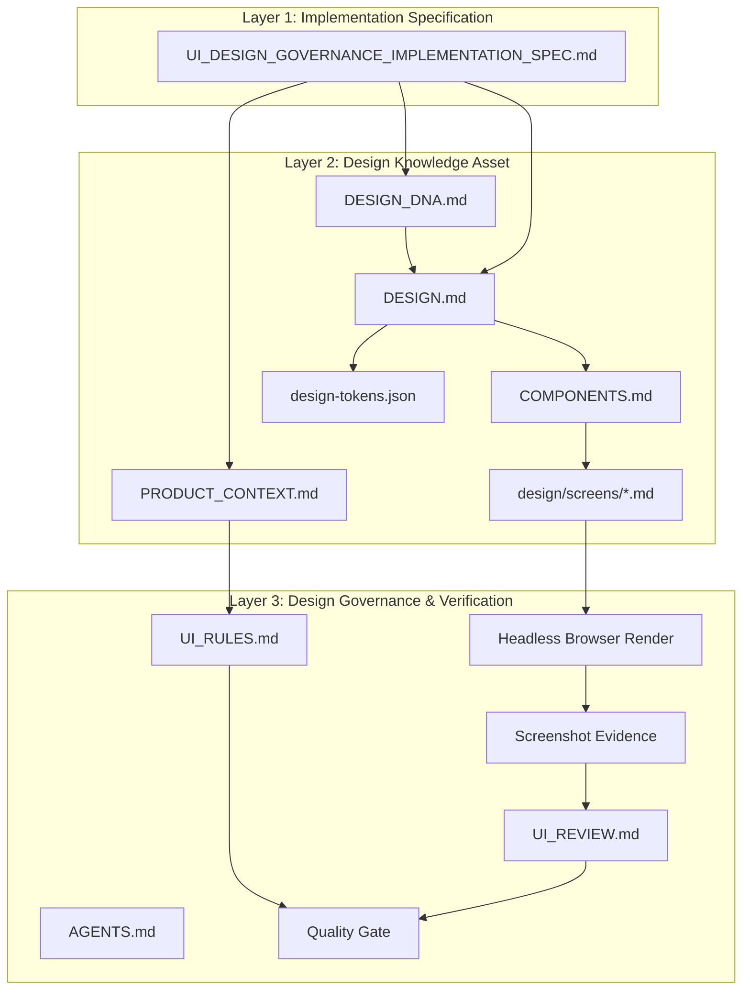
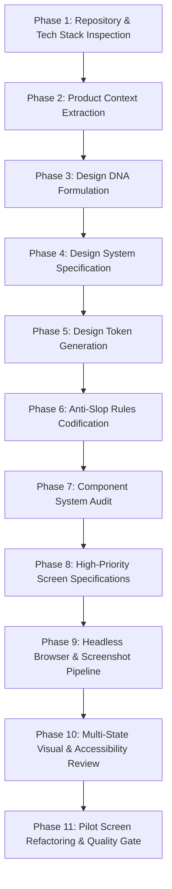

# AI UI Design Governance Implementation Specification & Runbook

> **Mission:** Establish a deterministic, machine-enforceable engineering system that governs AI coding agents designing web and software interfaces. Prevent aesthetic convergence to generic "AI Slop" (gratuitous purple/blue gradients, glowing borders, nested card soup, low information density, and uncalibrated component libraries) by binding UI generation to explicit Product Context, Design DNA, Strict Tokens, Component Systems, Screen Specifications, and Headless Browser Evidence.

---

## 1. Executive Summary & Architecture

AI coding agents left unconstrained inevitably converge toward internet-average visual cliches. This phenomenon ("AI Slop") stems from risk-avoidance heuristics in language models: defaulting to high-probability Tailwind classes, excessive whitespace, pill-shaped buttons, oversized headers, and marketing hero sections inside productivity tools.

This specification serves as the **Operational Runbook** for bootstrapping and maintaining the **AI UI Design Governance Framework**.

### The Three Structural Layers

1. **Implementation Specification (`UI_DESIGN_GOVERNANCE_IMPLEMENTATION_SPEC.md`):** The actionable runbook guiding agents through repository inspection, system bootstrapping, and audit verification.
2. **Design Knowledge Assets:** Persistent repository assets (`PRODUCT_CONTEXT.md`, `DESIGN_DNA.md`, `DESIGN.md`, `design-tokens.json`, `COMPONENTS.md`, `design/screens/*.md`) defining exact domain meaning and constraints.
3. **Design Governance & Verification Pipeline:** Continuous quality gates (`AGENTS.md`, `UI_RULES.md`, `UI_REVIEW.md`, automated screenshots, visual linter) enforcing compliance before PR merge.

---

## 2. Methodology & Prior Art Synthesis

Rather than naively chaining disparate external plugins, this framework synthesizes the highest-value insights from pioneering design and agent systems into a unified architecture:

| Prior Art / System | Core Philosophy Extracted | Implementation Mechanism in This Framework |
| :--- | :--- | :--- |
| **no-slop-ui** | Negative Constraint Design | `UI_RULES.md` Anti-Slop negative guardrails & automated AST regex linter. |
| **skill-web-design** | Design DNA & Personality | `DESIGN_DNA.md` defining archetype, visual register, density, and contrast. |
| **xiaopu-ai/web-design** | Spec-First UI Engineering | Mandatory `DESIGN.md` and `screens/*.md` before writing implementation code. |
| **ui-design-cc** | Structured Machine-Readable Tokens | `design/design-tokens.json` enforcing zero uncalibrated magic numbers. |
| **Agentic Design System** | Evidence-Based Browser Verification | Headless browser execution capturing multi-viewport screenshots. |
| **claude-web-design-skills** | Visual Inspection Repair Loop | Autonomous loop: `Render -> Capture -> Review -> Repair -> Verify`. |

---

## 3. The 11-Phase Implementation Workflow

When bootstrapping or auditing UI Design Governance in any repository, the AI Agent must execute this phased sequence:

### Phase 1: Repository & Tech Stack Inspection
- Detect UI rendering engine (React, Vue, Svelte, Static HTML/CSS, Next.js, Vite).
- Identify styling solution (Tailwind CSS, CSS Modules, Styled Components, Pure CSS).
- Inventory third-party UI component libraries (shadcn/ui, Radix, MUI, AntD).
- Audit current screenshots, tests, and CI/CD pipelines.

### Phase 2: Product Context Extraction (`PRODUCT_CONTEXT.md`)
- Extract true product purpose, user persona, domain expertise level, session duration, and primary workflows.
- Establish information density profile (High, Medium-High, Medium, Low).
- Prohibit generic showcase assumptions for high-utility productivity software.

### Phase 3: Design DNA Formulation (`DESIGN_DNA.md`)
- Select a distinct **Design Archetype** (e.g., *Clinical Precision*, *Terminal Noir*, *Modern Industrial*, *Warm Craft*).
- Define typographic hierarchy, accent color discipline, depth strategy, and motion rules.

### Phase 4: Design Specification (`DESIGN.md`)
- Specify exact typography scales, spacing units, corner radiuses, border styles, and control sizes.
- Ban arbitrary inline overrides and magic pixel adjustments.

### Phase 5: Design Token Generation (`design/design-tokens.json`)
- Export structured, JSON-schema-validated design tokens for colors, spacing, radius, controls, shadows, and breakpoints.
- Bind styling build targets (Tailwind config or CSS custom properties) to these tokens.

### Phase 6: Anti-Slop Rules Codification (`UI_RULES.md`)
- Codify explicit **Negative Constraints** (forbidden visual cliches) and **Positive Imperatives** (structure over decoration, typography over containers).

### Phase 7: Component System Audit (`design/COMPONENTS.md`)
- Inventory and standardize core controls: Buttons, Inputs, Selects, Checkboxes, Switches, Tables, Dialogs, Toasts, Empty States, and Loading Skeletons.
- Define purpose, sizing variants, interactive states, and accessibility contracts for each.

### Phase 8: High-Priority Screen Specifications (`design/screens/*.md`)
- Create formal screen specs for critical workflows (Dashboard, Login, Settings, API Keys).
- Detail purpose, primary user task, information architecture, and the mandatory **10 UI States**.

### Phase 9: Headless Browser & Screenshot Pipeline (`scripts/screenshot.mjs`)
- Provide zero-friction local browser automation via Chrome/Edge headless CLI or Playwright.
- Capture deterministic snapshots across Desktop (1440x900), Laptop (1280x800), Tablet (768x1024), and Mobile (375x812).

### Phase 10: Multi-State Visual & Accessibility Review (`UI_REVIEW.md`)
- Execute automated visual linting (`scripts/ui-review.mjs`).
- Audit contrast ratios, keyboard focus indicators, DOM semantics, and state coverage.

### Phase 11: Pilot Screen Refactoring & Quality Gate
- Select a single pilot screen (e.g., Developer Dashboard).
- Implement and iterate until 100% compliant with tokens, rules, screenshots, and accessibility criteria.
- Integrate into the repository's unified Quality Gate (`npm run quality`).

---

## 4. Definition of Done (DoD) Checklist

A UI task or page is **strictly incomplete** if any of the following items are unresolved:

- [ ] **Spec Compliance:** A verified `screens/<screen-name>.md` exists with purpose, layout, and states.
- [ ] **Design Token Conformance:** 100% of colors, radiuses, paddings, and font sizes reference `design-tokens.json` (zero hardcoded arbitrary pixel values).
- [ ] **Anti-Slop Linter Pass:** Zero prohibited patterns (gradients, glow, card-in-card, pill buttons) reported by `scripts/ui-review.mjs`.
- [ ] **Multi-Viewport Evidence:** Screenshots rendered and saved in `screenshots/desktop/`, `screenshots/tablet/`, and `screenshots/mobile/`.
- [ ] **Mandatory State Coverage:** Verified default, loading, empty, and error states rendered and visually coherent.
- [ ] **Accessibility (WCAG 2.1 AA):** Color contrast >= 4.5:1, visible keyboard focus rings, semantic markup.
- [ ] **Zero Layout Overflow:** Long strings, emails, table cells, and numerical values wrap or truncate with ellipsis without breaking page layout.
- [ ] **Unified Quality Gate:** `npm run quality` passes all code and design verifications cleanly.
