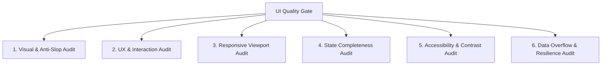

# UI Review & Quality Gate Protocol

> **Mandate:** Objective, multi-dimensional verification criteria that must pass before any UI feature or refactoring can be approved or merged.

---

## 1. The 6-Dimensional Review Matrix

---

## 2. Dimension 1: Visual & Anti-Slop Audit
- [ ] **No Cliche Gradients:** Zero purple/blue gradient backgrounds or gradient text fills.
- [ ] **No Glow:** Zero glowing neon box-shadows.
- [ ] **Disciplined Radiuses:** 100% of corner radiuses are <= 8px (except circular avatar chips).
- [ ] **No Card Soup:** Cards are not nested inside cards. Content uses typographic grouping.
- [ ] **Token Alignment:** All colors, sizes, and spacings map to `design/design-tokens.json`.
- [ ] **Visual Hierarchy:** Exactly one primary call-to-action per view.

---

## 3. Dimension 2: UX & Interaction Audit
- [ ] **Primary Task Clarity:** The user's primary goal on the screen can be identified and initiated in < 3 seconds.
- [ ] **Action Feedback:** All button clicks and async events show instantaneous visual feedback (< 100ms) or loading spinners.
- [ ] **Error Clarity:** Error messages explain *what happened*, *why*, and *how to remediate*.
- [ ] **Safe Destruction:** Destructive operations (delete, revoke, purge) require explicit confirmation with descriptive consequences.

---

## 4. Dimension 3: Responsive Viewport Audit
Screens must be verified against actual headless browser captures at:
- [ ] **Desktop (1440 x 900):** Full multi-pane workflow, persistent navigation, zero horizontal page scroll.
- [ ] **Laptop (1280 x 800):** Balanced spacing, data tables remain legible.
- [ ] **Tablet (768 x 1024):** Sidebar collapses to compact/drawer mode, metrics grid reflows to 2 columns.
- [ ] **Mobile (375 x 812):** Single column flow, touch targets >= 44px, tables support horizontal scroll without breaking page container.

---

## 5. Dimension 4: State Completeness Audit
- [ ] **Default State:** Verified with realistic production data.
- [ ] **Loading State:** Structured skeleton loader matching the destination layout (no generic whole-screen spinner).
- [ ] **Empty State:** Helpful empty state with explanatory text and a direct creation CTA.
- [ ] **Error State:** In-place error banner or recovery prompt with retry trigger.
- [ ] **Disabled State:** Visually distinct, non-clickable, with explanatory tooltip if applicable.

---

## 6. Dimension 5: Accessibility & WCAG 2.1 AA Audit
- [ ] **Contrast Ratio:** Text-to-background contrast >= 4.5:1 (normal text) and >= 3:1 (large text / icons).
- [ ] **Keyboard Navigability:** Tab key navigates all interactive elements in logical source order.
- [ ] **Visible Focus:** Clear 2px focus ring on all focused elements.
- [ ] **ARIA Roles:** Proper `role="dialog"`, `role="alert"`, `aria-expanded`, and form `<label>` associations.

---

## 7. Dimension 6: Data Overflow & Boundary Audit
- [ ] **Long Text Strings:** 64+ character emails, file paths, and project names truncate cleanly with ellipsis or wrap safely without breaking layout containers.
- [ ] **Extreme Numbers:** Values like `1,492,842,912` or `$99,999.99` fit inside metric badges without overlapping adjacent units.
- [ ] **Zero Data & Large Data:** Tables render cleanly with 0 rows, 1 row, and 1,000+ paginated rows.
